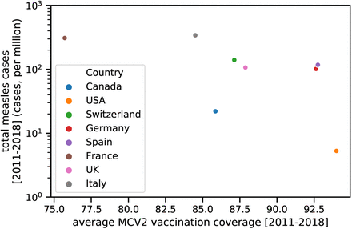

<!-- Main -->

<!-- One -->
<section id="one">
	

		<header class="major">		</header>
			Here follows a list of my main research projects 
			
(a list of publications can also be found on my <a href="https://scholar.google.com/citations?user=DYC1LN8AAAAJ&hl=en">Google Scholar profile</a> )

		<h2>Main PhD projects</h2>
			My PhD thesis, that basically list my main 4 works, can be <a href="https://infoscience.epfl.ch/record/277118"> found here </a>  
			<h3>FoodRepo: An Open Food Repository of Barcoded Food Products</h3>
			<blockquote>
				Here, we present this system, which we call FoodRepo (https://www.foodrepo.org), an openly accessible database of barcoded food products, and we describe the data-acquisition framework, its quality control and maintenance.
			</blockquote>
			
			
<a href="https://www.frontiersin.org/articles/10.3389/fnut.2018.00057/full"> Link to the original paper</a>

			<h3> Assessing the Dynamics and Control of Droplet- and Aerosol-Transmitted Influenza Using an Indoor Positioning System </h3>			
			In this work we assess the effect of improved ventilation in a school setting, on the spread of influenza, using previously recorded contact among school students and workers.
				<blockquote> we find that bringing ventilation to recommended levels had the same mitigating effect as a vaccination coverage of 50% to 60%. Ventilation is an easy-to-implement strategy that has the potential to support vaccination efforts for effective control of influenza spread</blockquote> 
			
			
<a href="https://www.nature.com/articles/s41598-019-38825-y">Link to the original paper </a>

			
Code and plots can be found in the <a href="https://github.com/ggrrll/aerosol">related GitHub repo</a> 

			<h3>A digital reconstruction of the 1630–1631 large plague outbreak in Venice</h3>
			<blockquote>
				Here, we present an analysis of the 1630–1631 plague outbreak in the city of Venice, using newly collected daily death records. We identify the presence of a two-peak pattern, for which we present two possible explanations based on computational models of disease dynamics. 
			</blockquote>
			
			
<a href="https://www.nature.com/articles/s41598-020-74775-6"> Link to the original paper</a>

			<h3>Breaking Apart Contact Networks with Vaccination</h3>
				
In this work we assessed the effect of 'social segregation' on the sperad of higly-infectious diseases, like measles,  in order to propose an explanation for variability observed in outbreak size, across countries with similar vaccination coverages.

				<blockquote> We find the largest effects to be in the regime of relatively high vaccination coverages of around 80%, where despite vaccination being random, outbreak sizes can vary by a factor of 20.</blockquote>
				
				
<a href="https://www.biorxiv.org/content/10.1101/2020.03.01.971630v1.abstract"> Link to the original paper</a>

		<h2>Other projects (during PhD times)</h2>
			<h3>Implementation of NutriScore in FoodRepo</h3>
				<iframe id="igraph" scrolling="no" style="border:none;" seamless="seamless" src="https://ggrrll.github.io/Nutriscore-of-FoodRepo/3d_nutrients_&_nutriscore.html" height="500" width="80%"></iframe>	
<!-- 	<iframe id="igraph" scrolling="no" style="border:none;" seamless="seamless" src="https://ggrrll.github.io/Nutriscore-of-FoodRepo/3d_nutrients_&_category.html" height="500" width="50%"></iframe> -->
				
More details can be found in the <a href="https://github.com/ggrrll/Nutriscore-of-FoodRepo">related GitHub repository</a>

			<h3>Explorative Data Analysis of FoodRepo dataset</h3>
				<iframe id="igraph" scrolling="no" style="border:none;" seamless="seamless" src="https://ggrrll.github.io/foodrepo_data_analysis_public/clustering_3D.html" height="500" width="90%"></iframe> 
				
More details can be found in the <a href="https://github.com/ggrrll/foodrepo_data_analysis_public">related GitHub repository</a>

			<h3>HopSuisse!</h3>
			 
Project for Applied Data Analisys course, at EPFL <a href="https://github.com/ggrrll/hop_suisse_ada_project_public">(link to the website)</a>

			 
			 <h3>Data Analsys on Improvisation Dance dataset</h3>
			 	One of the project during the 2018 Complex Systems Summer School (CSSS), in Santa Fe (NM)
			 	
(find the final papers of the summer school here: <a href="https://wiki.santafe.edu/index.php/Complex_Systems_Summer_School_2018-Final_Papers">Complex_Systems_Summer_School_2018-Final_Papers)</a>

			 <h3>Cancer Biomarkers identification</h3>
			 	ML driven classification of a ovarian cancer dataset, for the identification of relevant cancer biomarkers
			 	
			 	
More details can be found in the <a href="https://github.com/ggrrll/ovarian_cancer_public">related GitHub repo</a>
			 	
		<h2> MSc paper </h2>
			Here is the paper that constitues basically my MSc thesis.
			
<a href="https://arxiv.org/abs/1304.0404">Link to original paper</a> 

		

</section>

