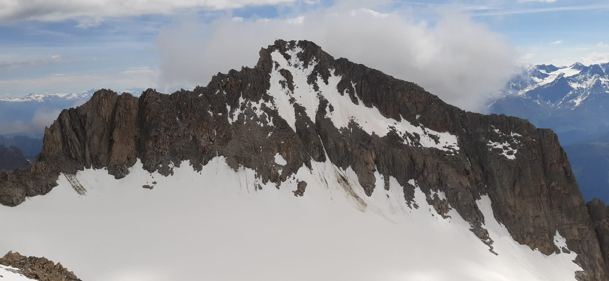
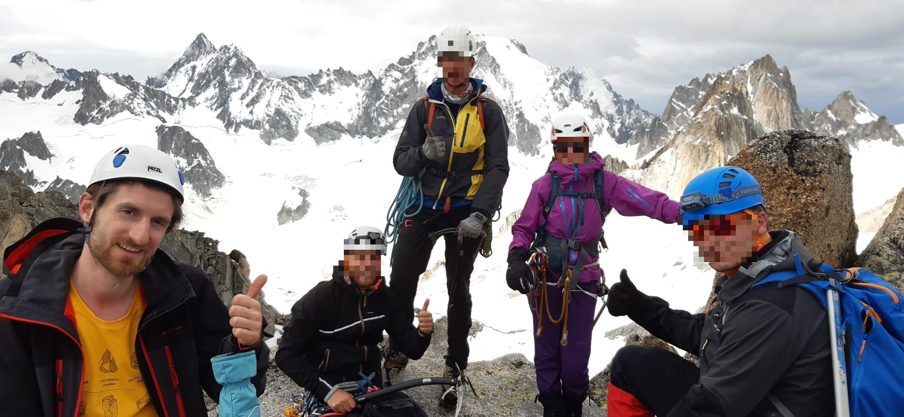
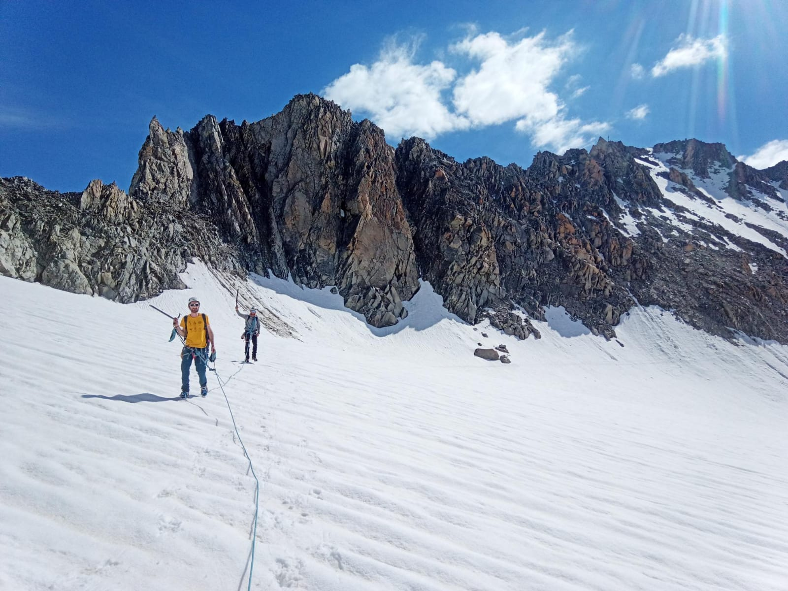

 dinner at the capanne d'Orny (entry: tomato soup :)) 

 vegetarian option :) 

 view from the capanne, at sunset 

	<video width="700" height="600" controls>
	  <source src="../assets/images/summer/portalet/VID_20210626_212329.mp4" type="video/mp4">
	Your browser does not support the video tag.
	</video>

	

 early morning start: the sun 

 early morning start: the moon 

 flat part before descent to 2nd glacier (Ravines Rousses) 

 Le Portalet: its W-face looks scary ...from the col de Plines 

 ...it looks better from a closer view :) 

 steep-ish ascent on W-face 

 at the summit :) 

 same W-face -- descent 

 crossing back the 2nd glacier -- view on the 1st cordée 

 crossing back the 2nd glacier 

 back up: steep short snowy ridge -- view on Aigulles Dorées 

