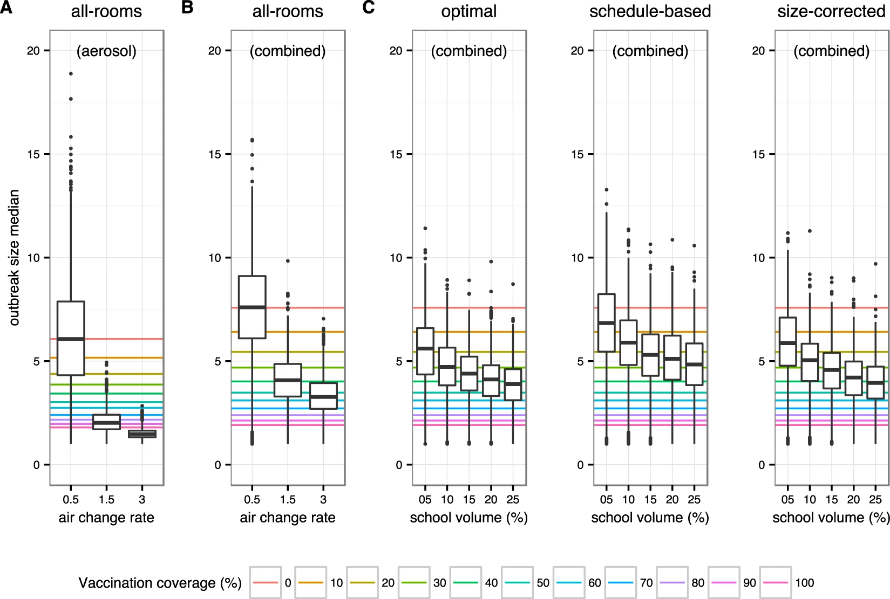
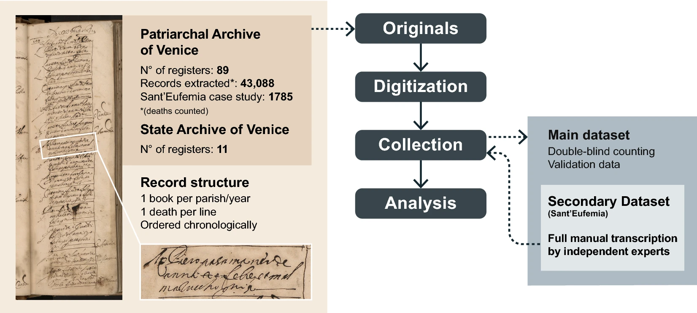

<!-- Main -->

<!-- One -->
<section id="one">
	

		<header class="major">		</header>
			Here follows a list of my main research projects 
			(a list of publications can also be found on my <a href="https://scholar.google.com/citations?user=DYC1LN8AAAAJ&hl=en">Google Scholar profile</a> )
		<h2>Main PhD projects</h2>
			My PhD thesis, that basically list my main 4 works, can be <a href="https://infoscience.epfl.ch/record/277118"> found here </a>  
			<h3>FoodRepo: An Open Food Repository of Barcoded Food Products</h3>
			<blockquote>
				Here, we present this system, which we call FoodRepo (https://www.foodrepo.org), an openly accessible database of barcoded food products, and we describe the data-acquisition framework, its quality control and maintenance.
			</blockquote>
			<!--  -->
			<a href="https://www.frontiersin.org/articles/10.3389/fnut.2018.00057/full"> Link to the original paper</a>
			<h3> Assessing the Dynamics and Control of Droplet- and Aerosol-Transmitted Influenza Using an Indoor Positioning System </h3>			
			
In this work we assess the effect of improved ventilation in a school setting, on the spread of influenza, using previously recorded contact among school students and workers.
				<blockquote> we find that bringing ventilation to recommended levels had the same mitigating effect as a vaccination coverage of 50% to 60%. Ventilation is an easy-to-implement strategy that has the potential to support vaccination efforts for effective control of influenza spread</blockquote>
			<a href="https://www.nature.com/articles/s41598-019-38825-y"> Link to the original paper </a> 
			

			
			<h3>A digital reconstruction of the 1630–1631 large plague outbreak in Venice</h3>
			<blockquote>
				Here, we present an analysis of the 1630–1631 plague outbreak in the city of Venice, using newly collected daily death records. We identify the presence of a two-peak pattern, for which we present two possible explanations based on computational models of disease dynamics. 
			</blockquote>
			
			
<a href="https://www.nature.com/articles/s41598-020-74775-6"> Link to the original paper</a>

			<h3>Breaking Apart Contact Networks with Vaccination</h3>
				
In this work we assessed the effect of 'social segregation' on the sperad of higly-infectious diseases, like measles,  in order to propose an explanation for variability observed in outbreak size, across countries with similar vaccination coverages.

				<blockquote> We find the largest effects to be in the regime of relatively high vaccination coverages of around 80%, where despite vaccination being random, outbreak sizes can vary by a factor of 20.</blockquote>
				<a href="https://www.biorxiv.org/content/10.1101/2020.03.01.971630v1.abstract"> Link to the original paper</a>
	<h2> MSc paper </h2>
		Here is the paper that constitues basically my MSc thesis.
		
<a href="https://arxiv.org/abs/1304.0404">Link to original paper</a> 

	

	

<!-- Content -->

</section>

