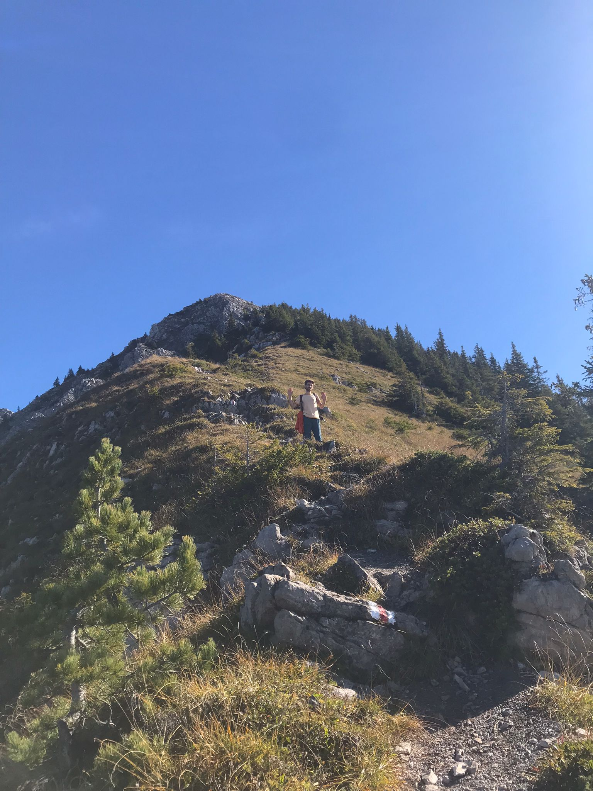
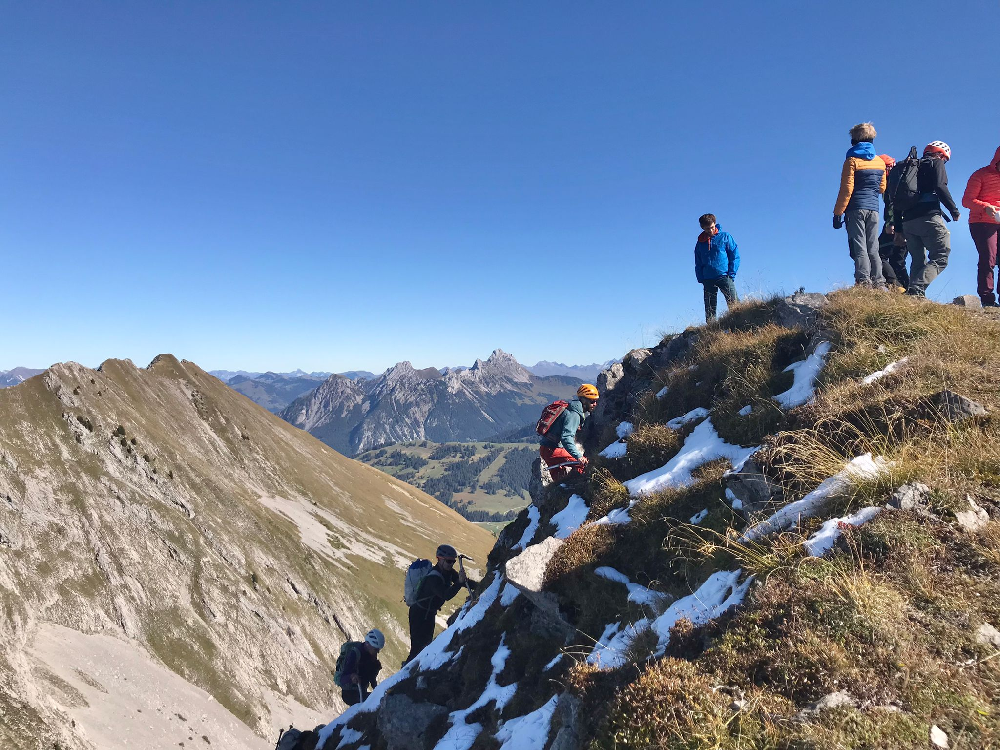
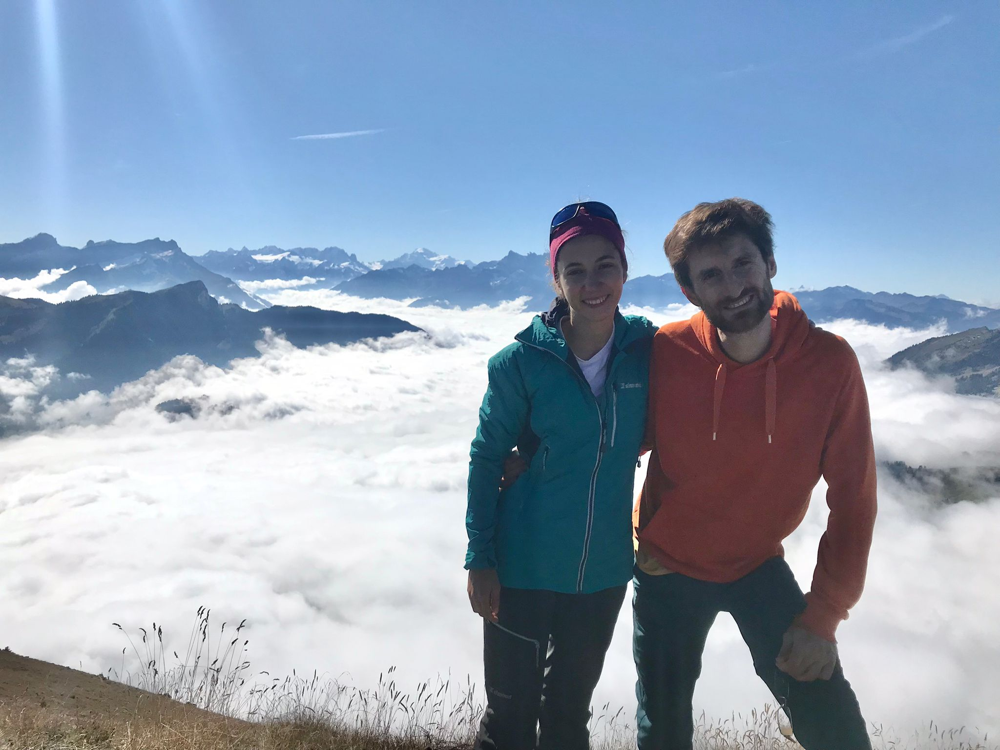
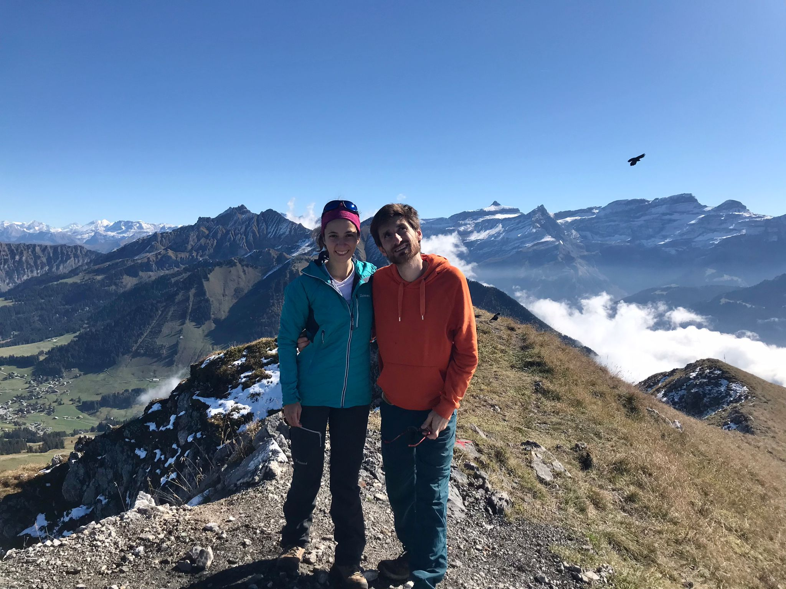
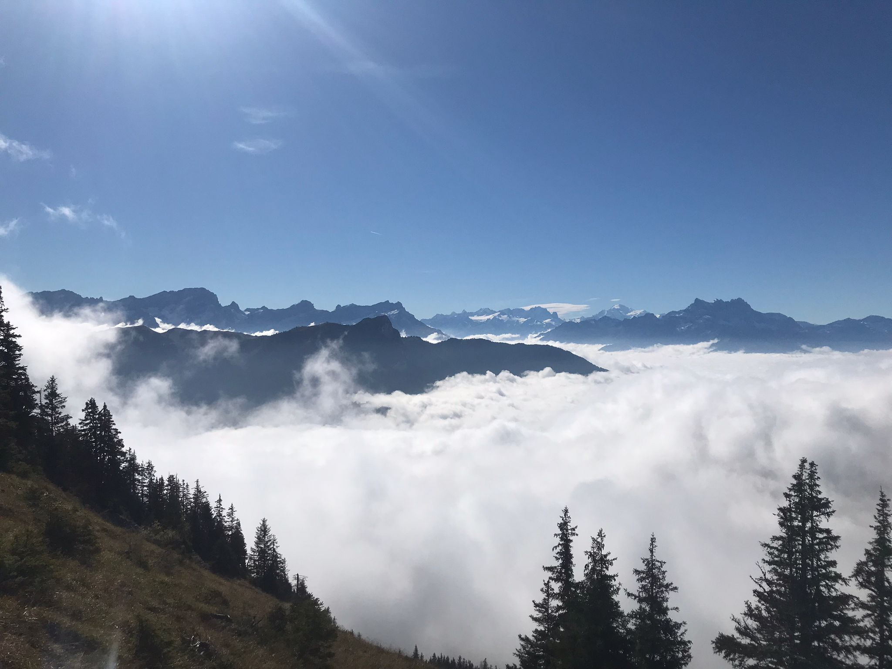
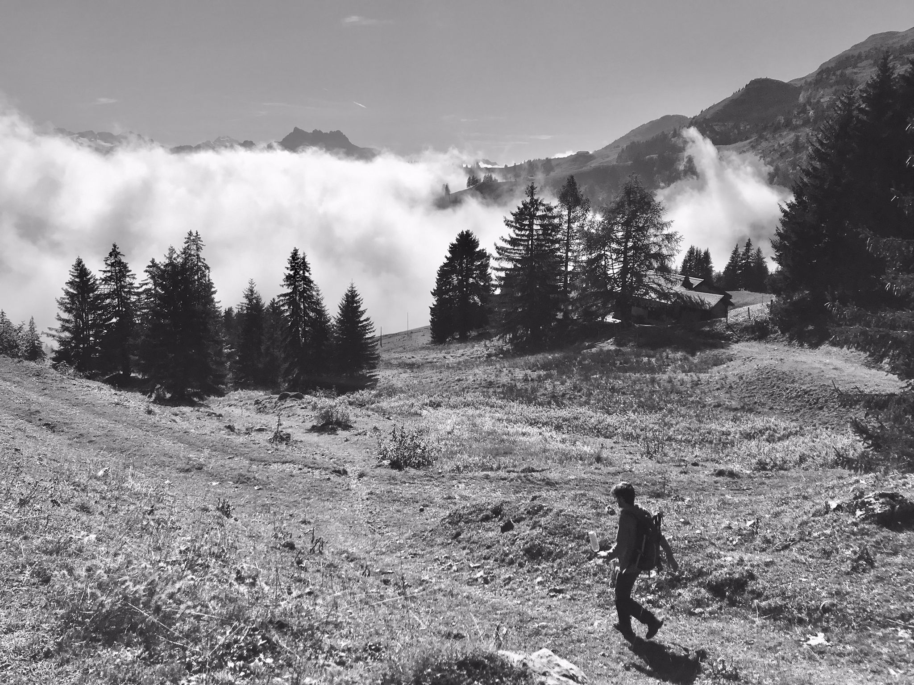

mid way, on the W ridge

 at the top, we wait a bit to meet a friend, with a group climbing the N-ridge (T5/PD) 

 at the top (view on Mont Blanc massif) 

 at the top (view on Diableret massif -- on the right) 

 view towards South -- at the center-right, the Mont Blanc massif 

 on our way down 

