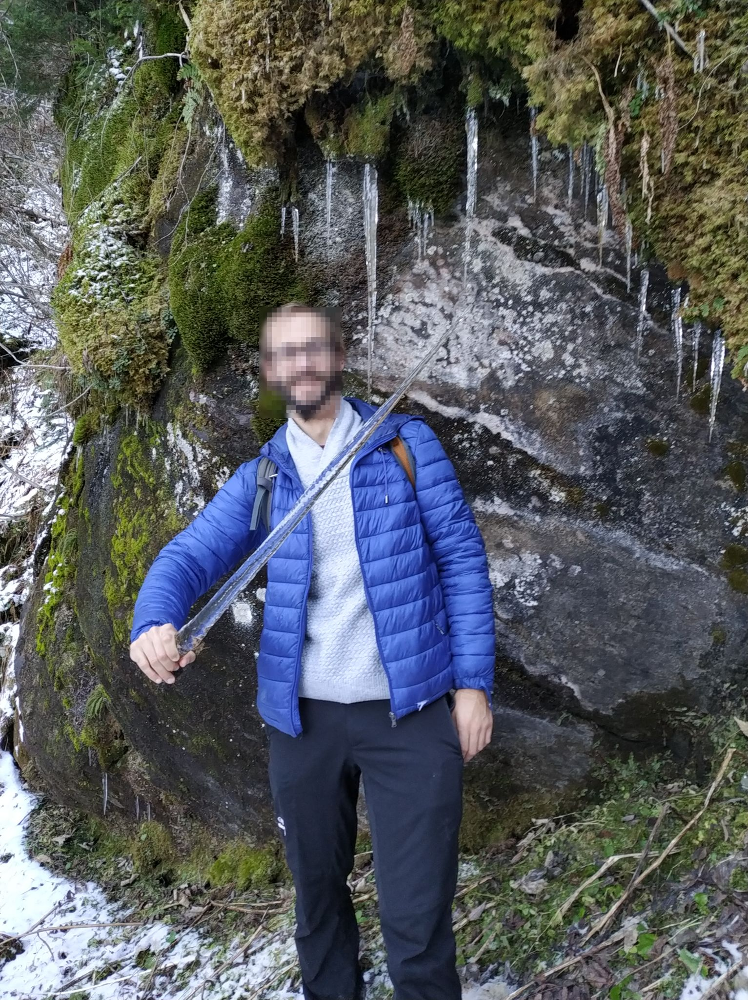
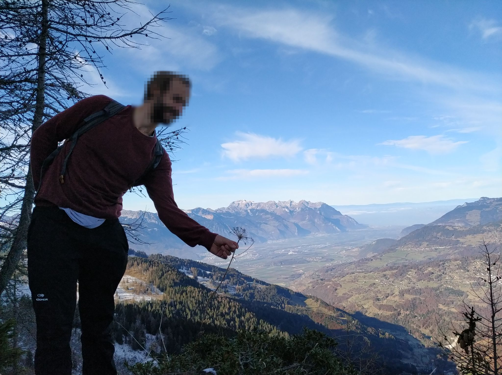
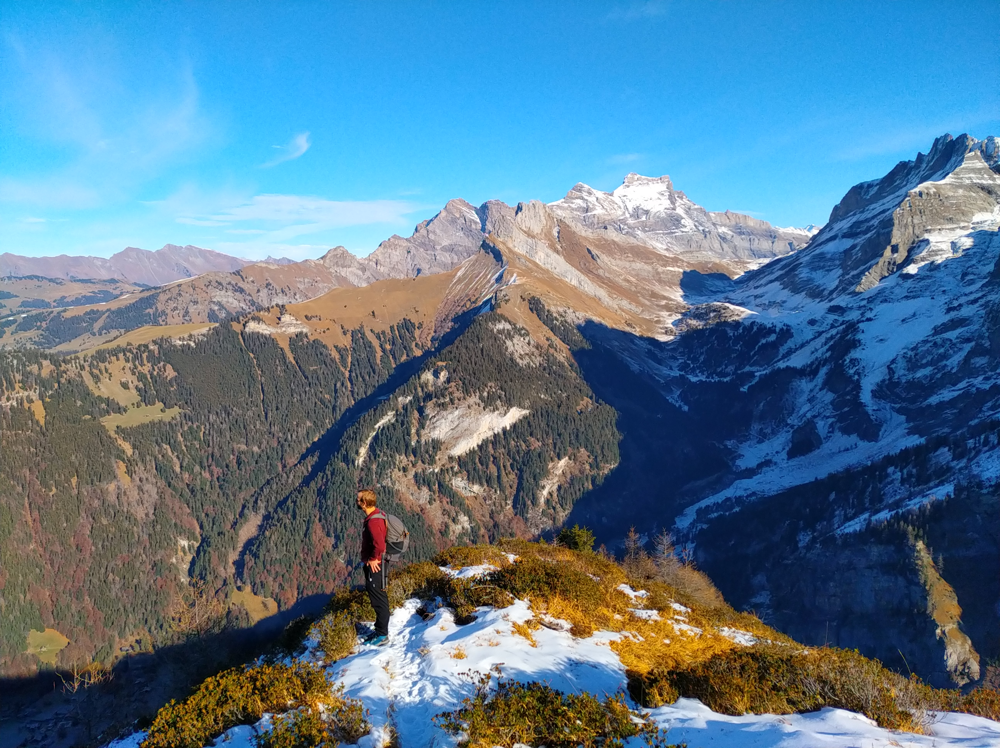
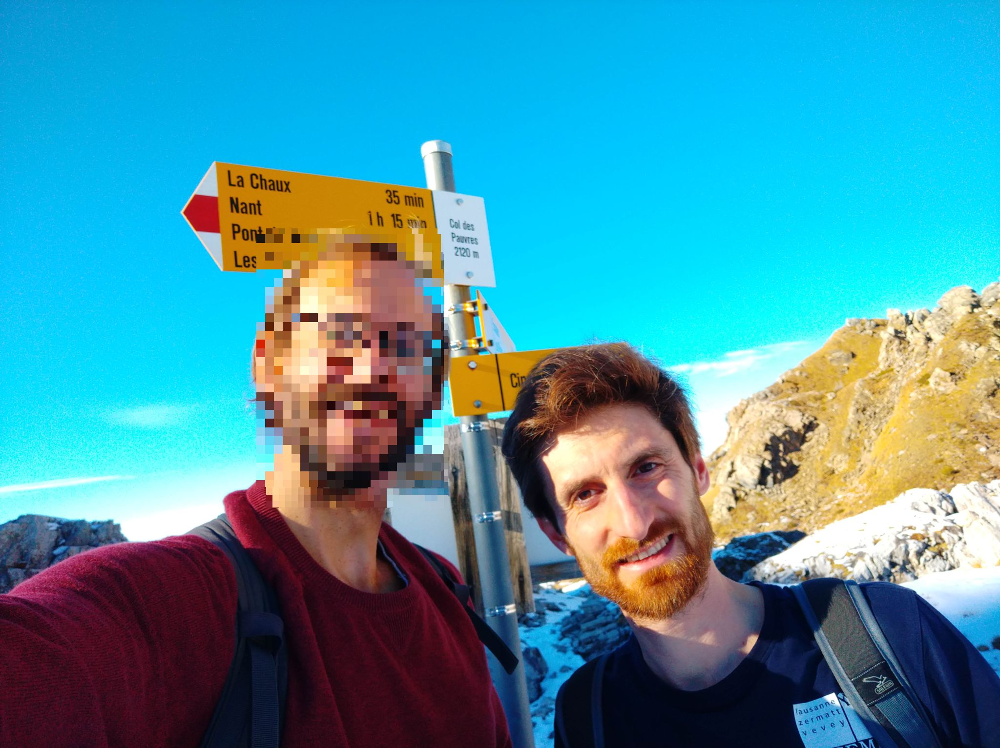
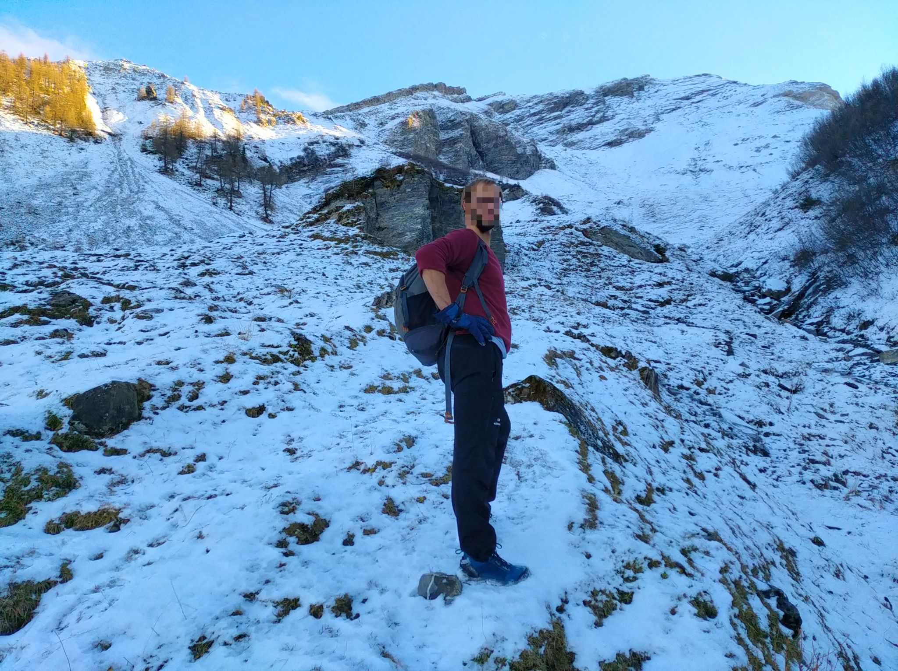
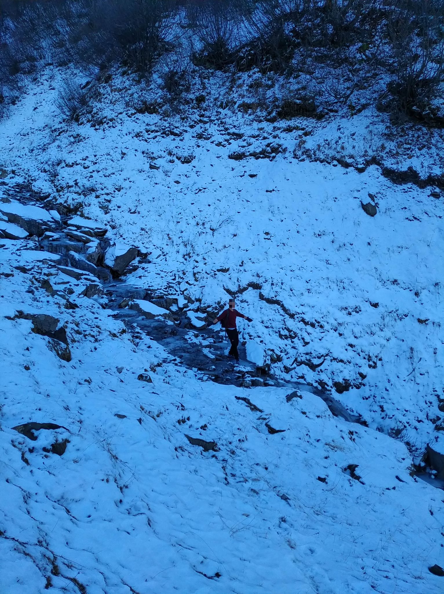

first path on the forest: first signs of winter :)

beautiful view on Rhole Valley and lake Leman

view on Argentine massif and col des Essets

on the way down, at the Col des Pauvres

on the way down, in the combe d'Euzannne -- first snow of the season

the little canal is walkable :) 

