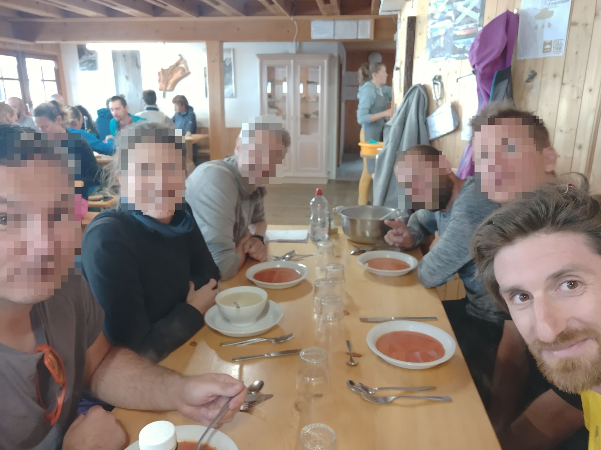
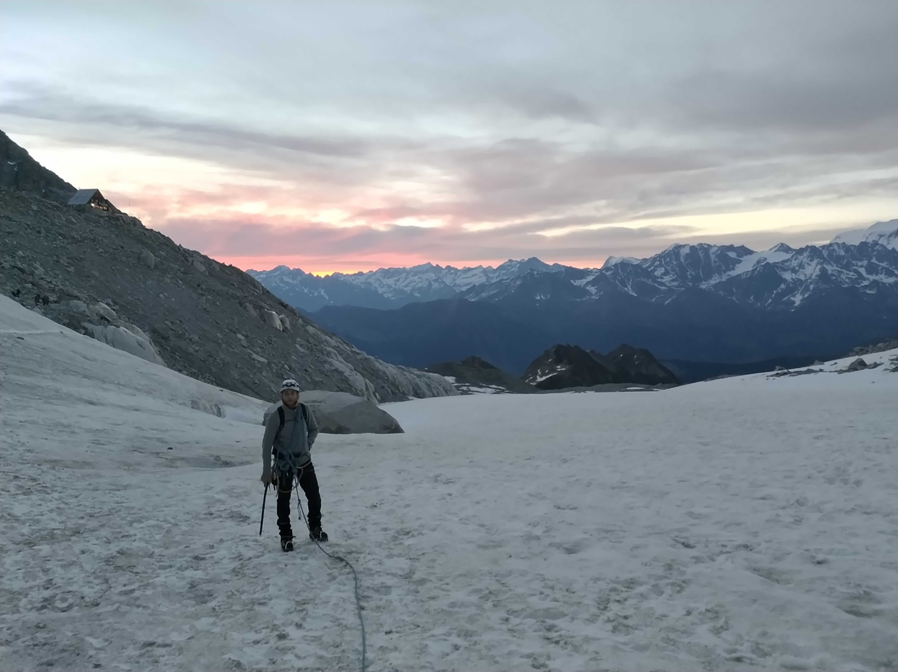
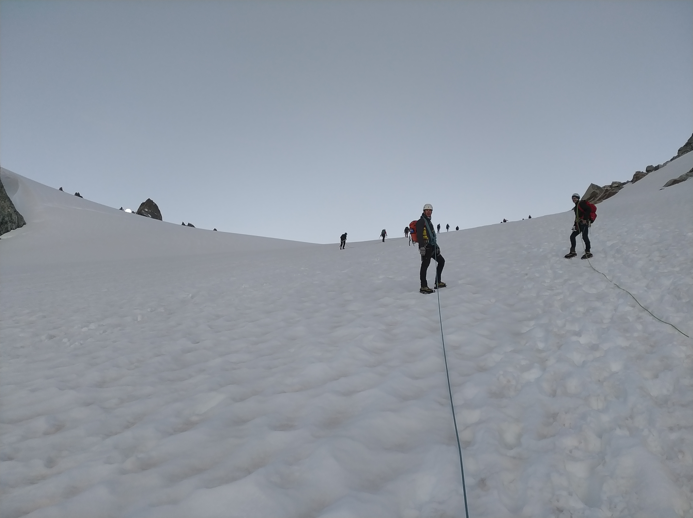
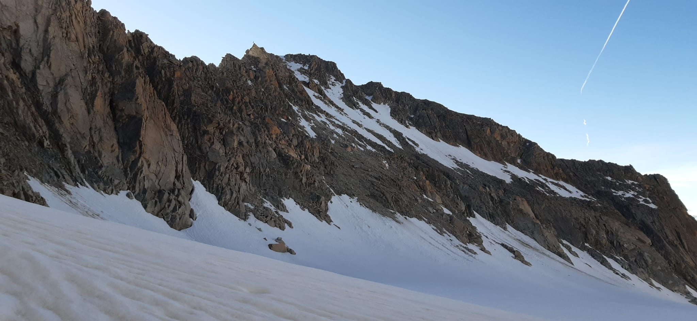
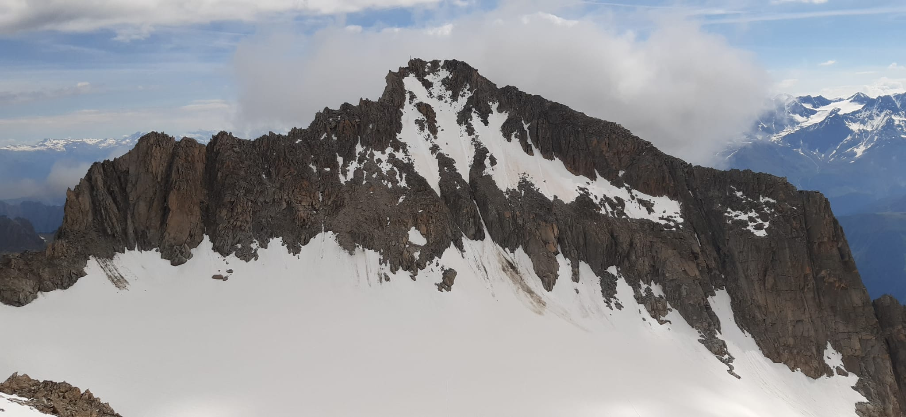
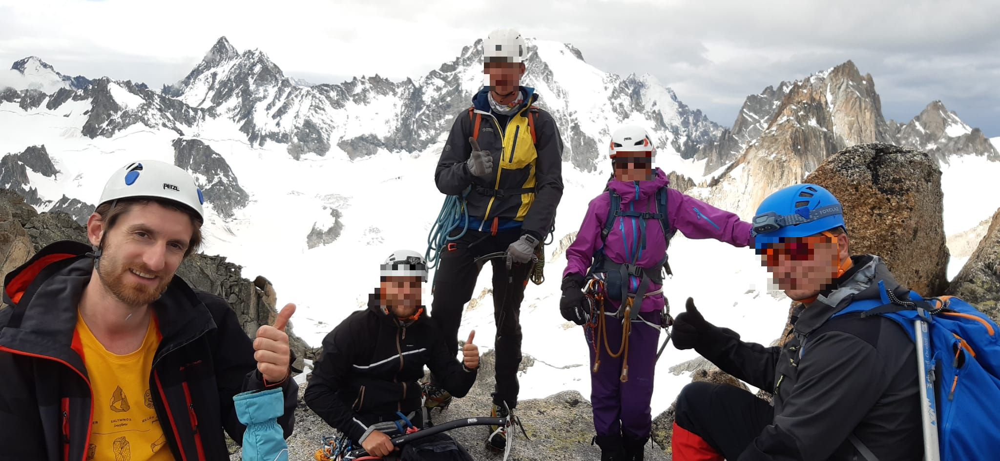
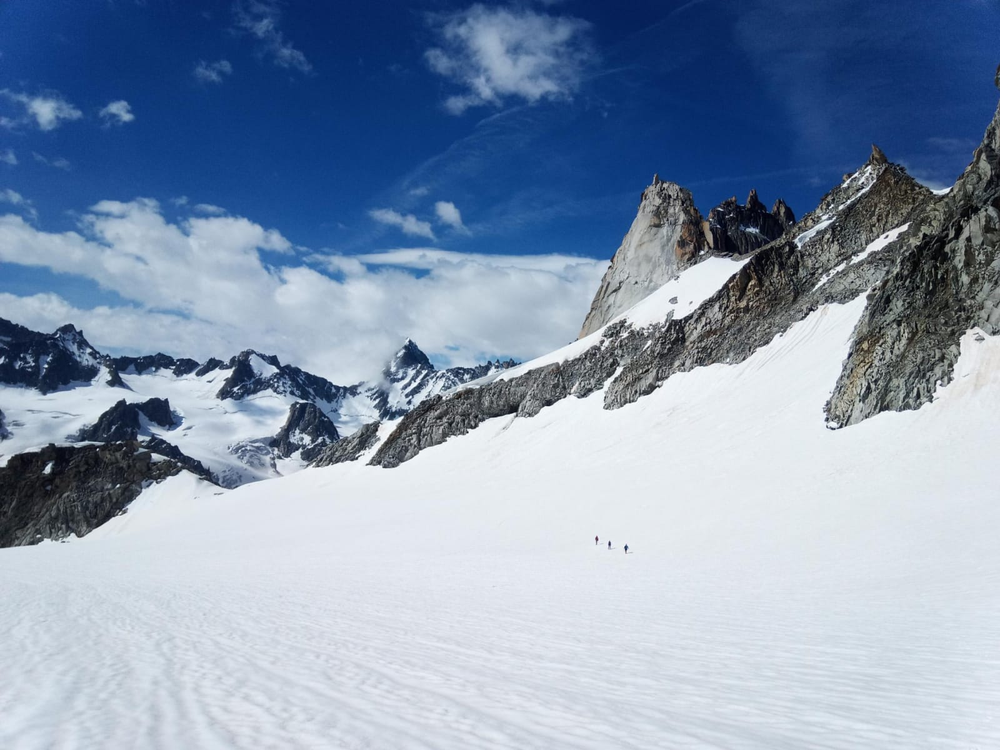
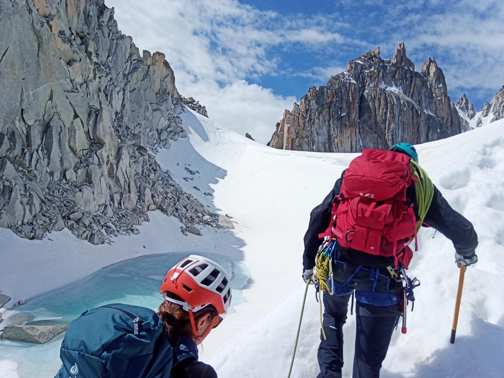
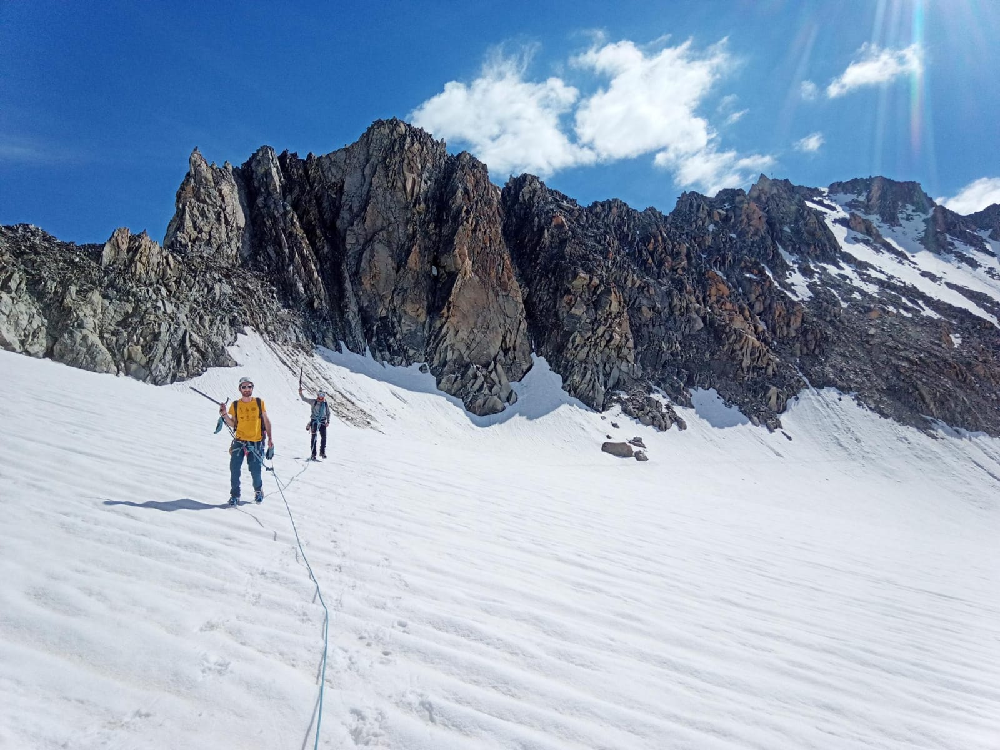

 dinner the day before, at CAS hut 

 early morning start (5am) 

 

 

 

 on the steep face W 

 goal of the day 

 

 at summit

 going down ...

... on the little glacier 

 on the way back: view on aigulles dorées 

 

