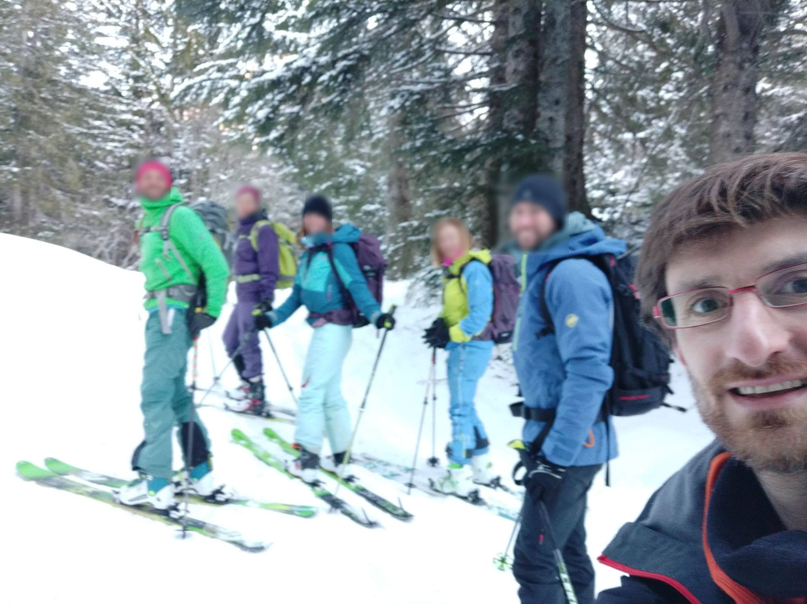
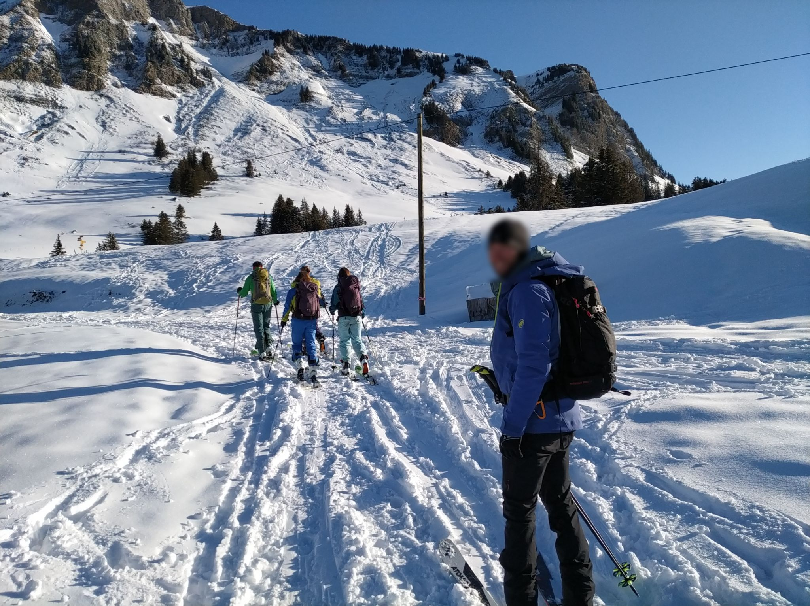
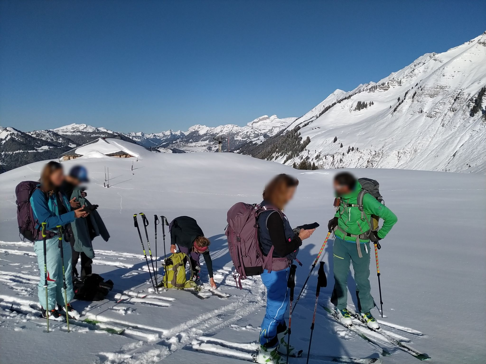
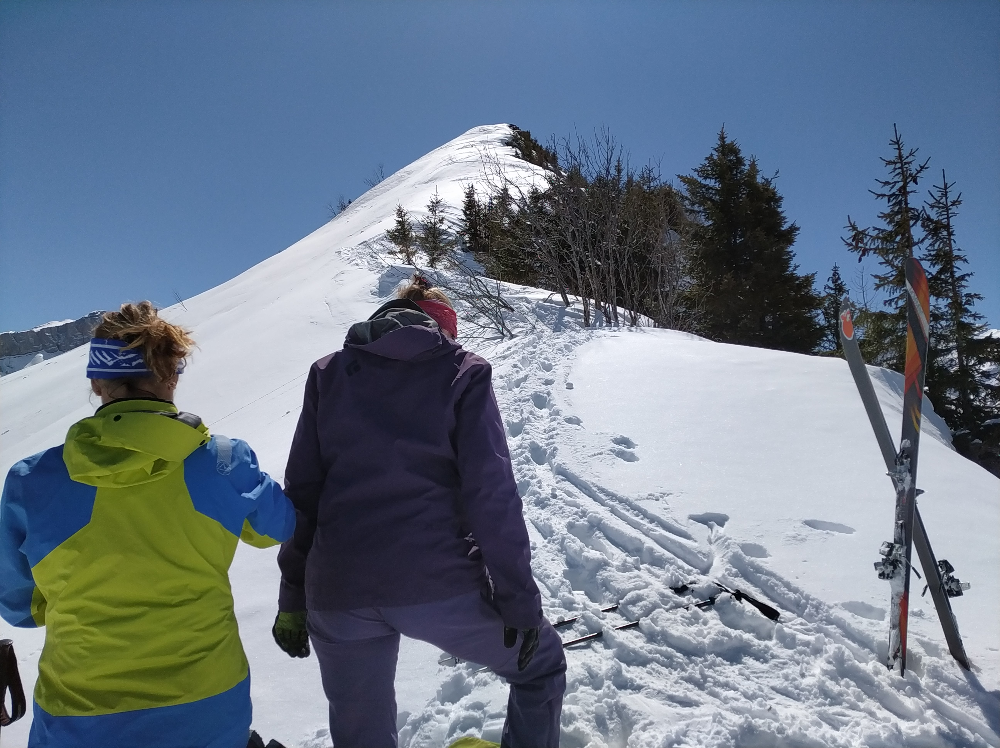
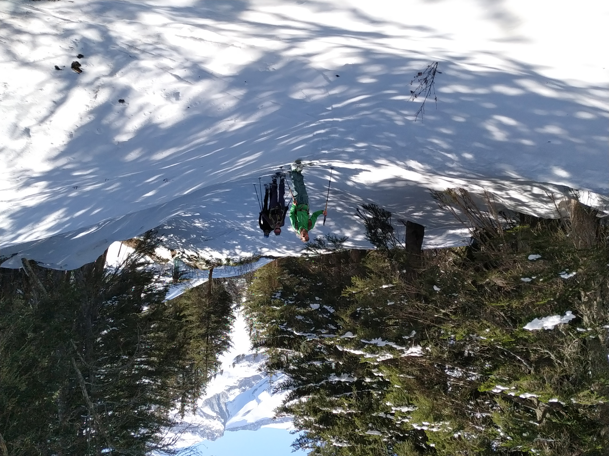

 Starting point from the parking, at Col du Pillon (07h 56m) 

chill start :), on the way to the first summit (Palette d'Isenau)

a little first pause, before the 1st summit

steep N-ridge to the 2nd summit (not all of us attempted it)

final passage in the forest, before the last (5th) summit (16h 05m) 

 
