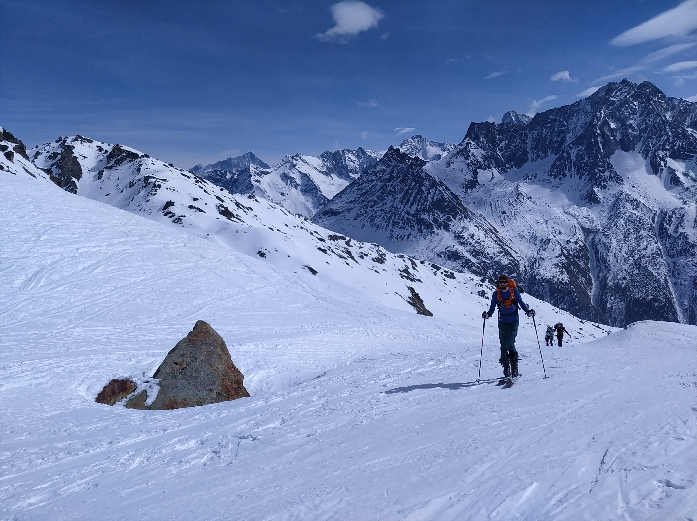

starting point :)

 

 going up -- beautiful view on Weisshorn (far right) 

 almost at the cabanne 

 at the 'top' -- mountains, mountains everywhere :) 

 there hand were still complaining about cold :) -- getting ready to go down (in the horrible frozen snow) 

