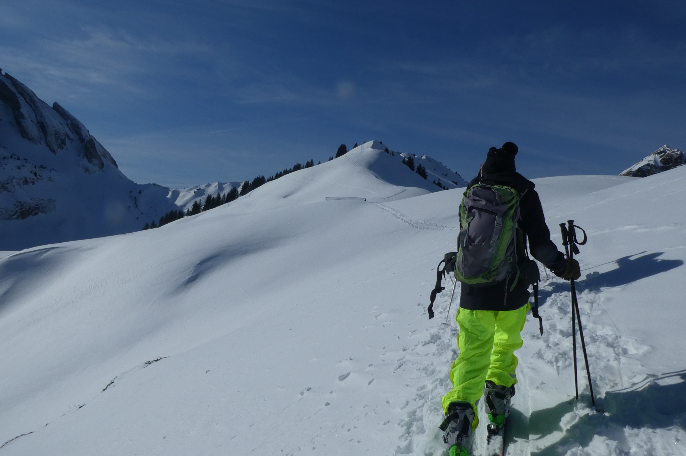
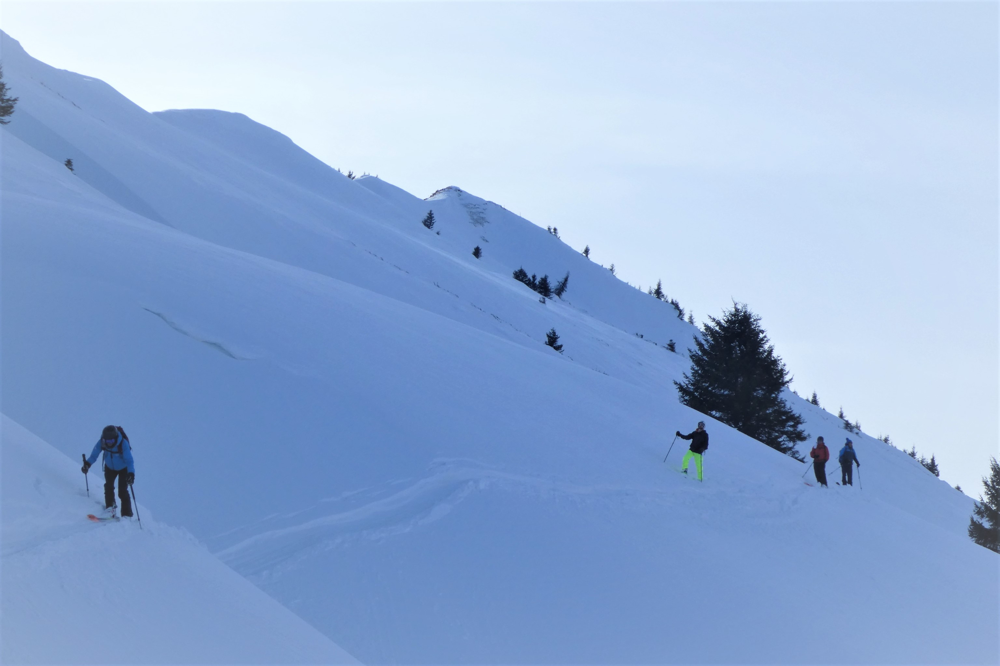

 start from the bus stop, at Grand Paradis ski station (~ 10am) 

 view on Dents du Midi 

 little example on how avalaches form 

 nice plateau, before the ridge  

 starting the ridge (Arête de Berroi) 

 final slope, with view on the top 

 almost there -- taking it easy 

 summit team :) 

 on the way down: very nice slope with powder :) 

 nice descent in the powder

slopes, beautiful slopes... (still, good to keep some distance ;) ) 

