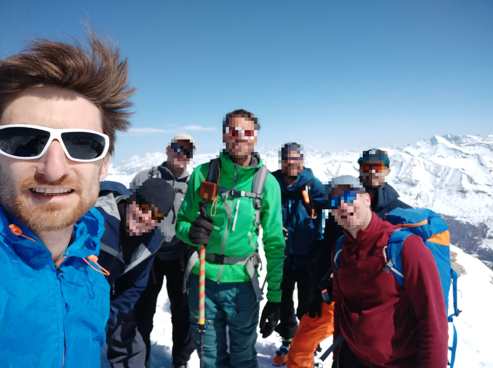

 Starting point from the parking

 frozen snow in the first part, in the forest

going up -- last efforsts before the ridge

 on the ridge (some decided to walk, others to put crampons on ski)

finally, at the top :)
 

view from the top

descending the ridge

