
 start from the parking around 9.40 -- at Grand Saint Bernard Hospice at 11.20 

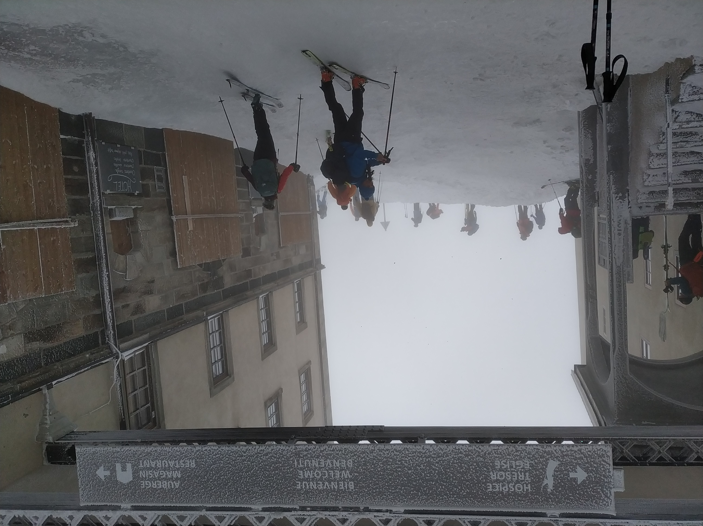

 our photographer :), during a sunny break  

 putting back the skins, for the final ascent 

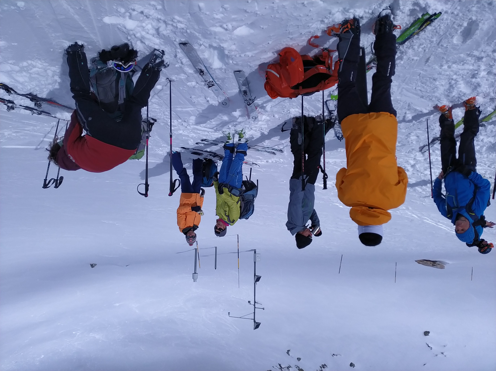

 on the way up: 2nd part 

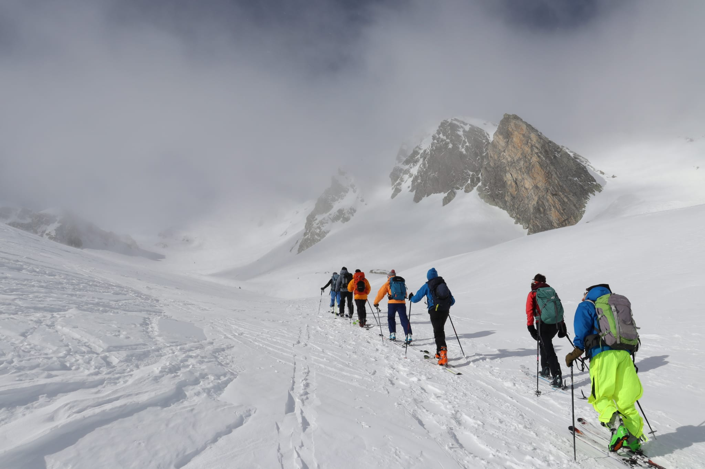

 ... in the tunnel! (no  cars :))

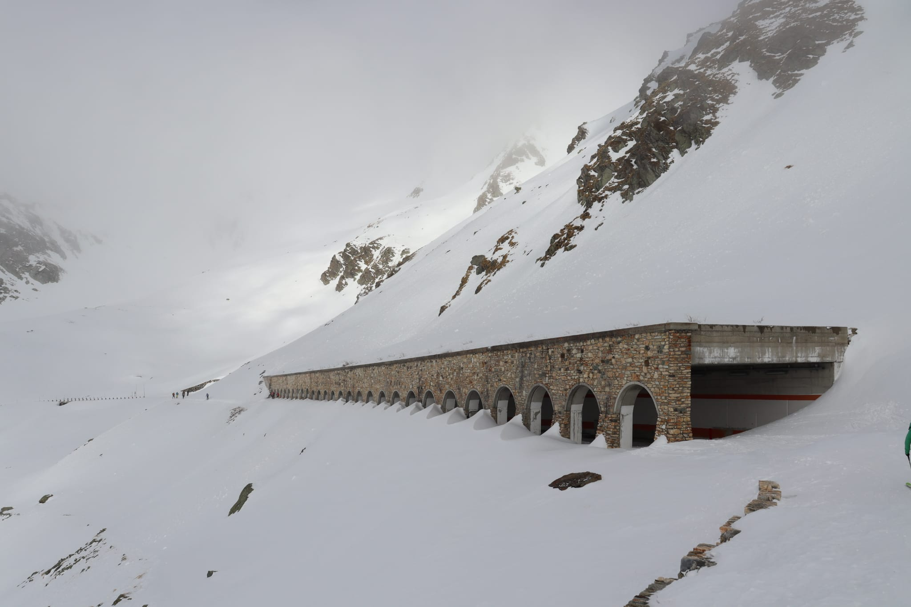

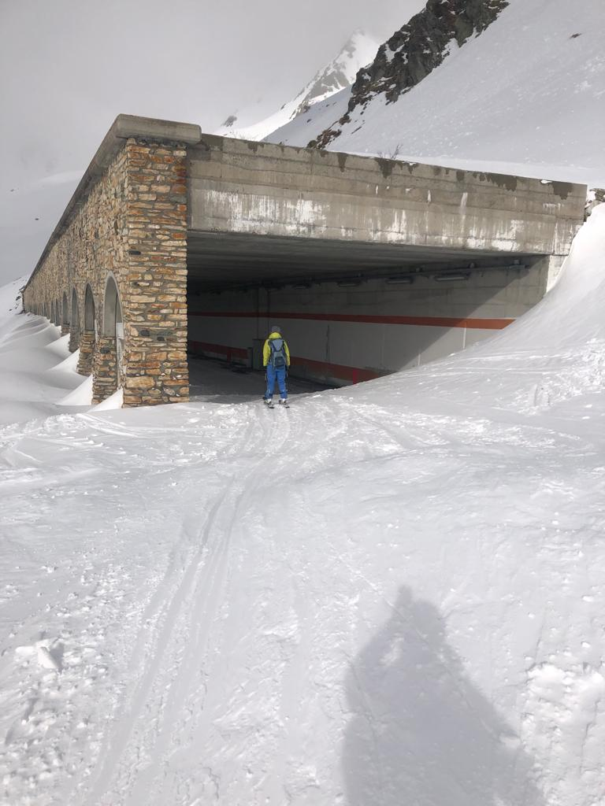

 getting out of the tunnel 

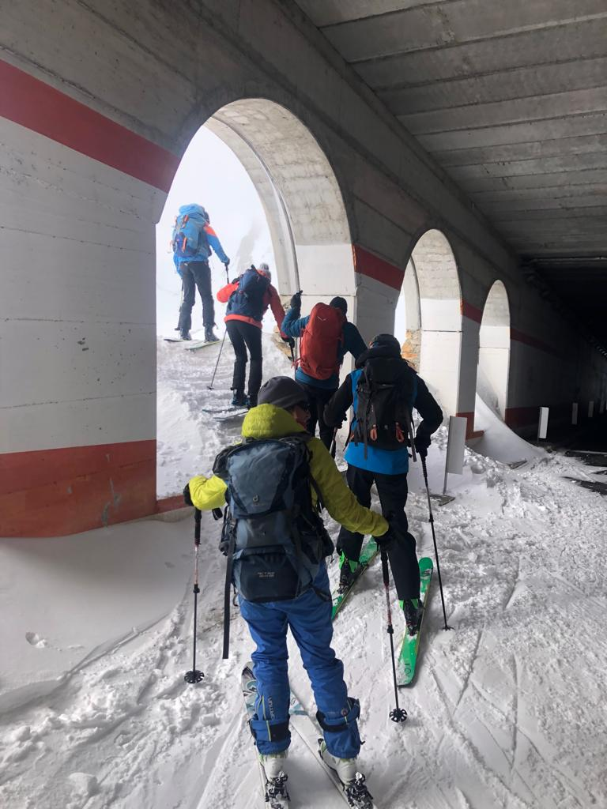

 almost there!

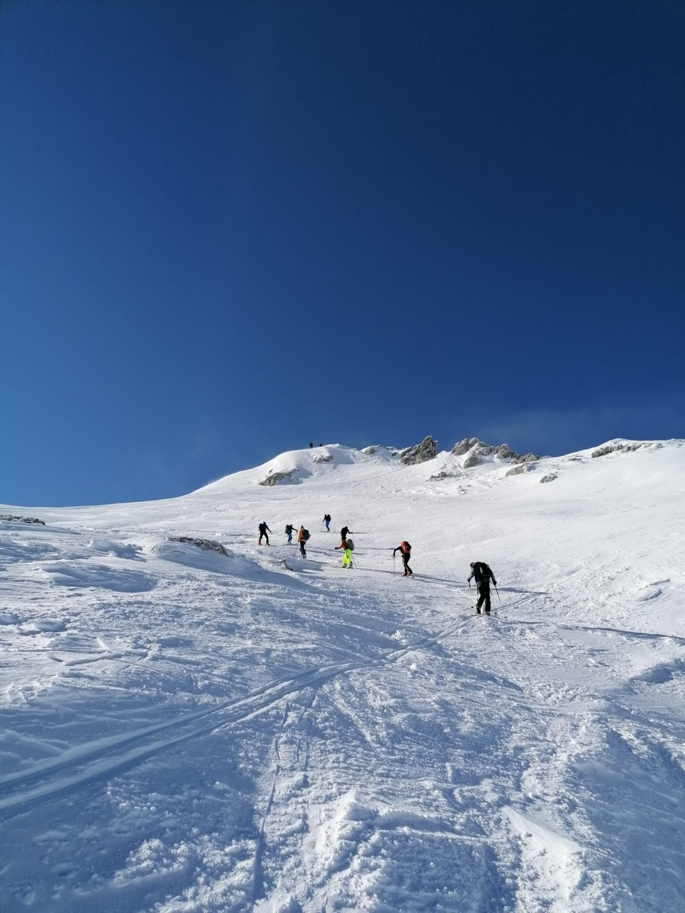

at the top

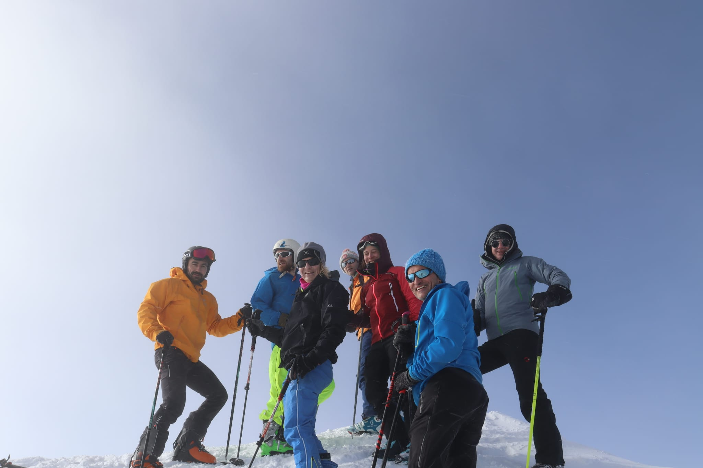

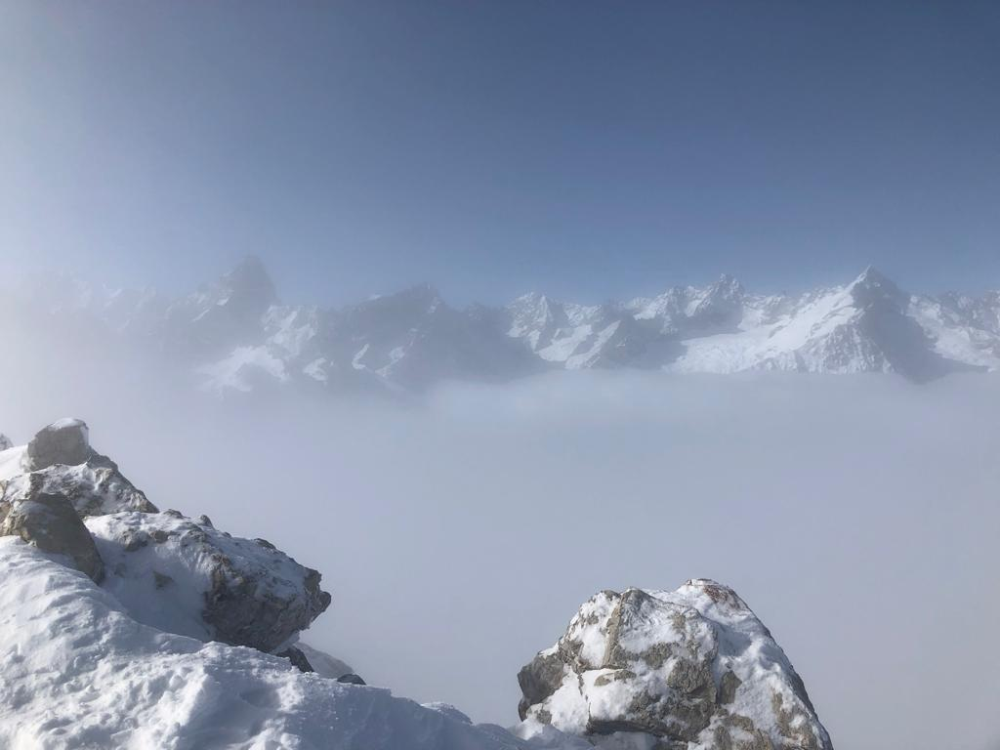

starting going down: last part it's on foot 

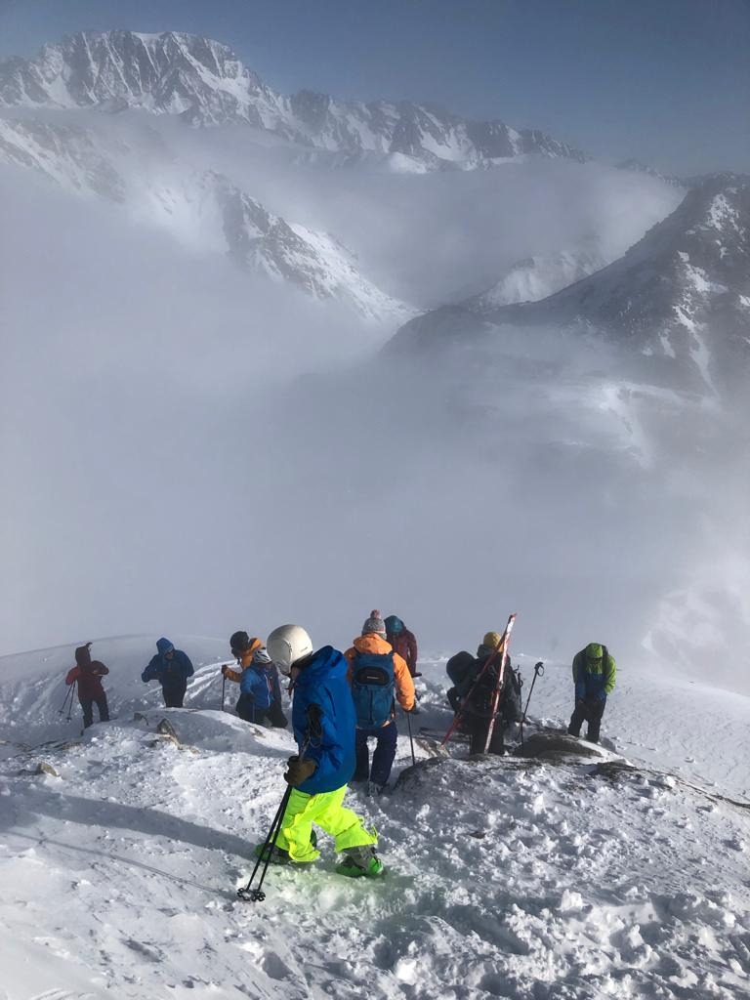

 yes, this time I fell only once :) 

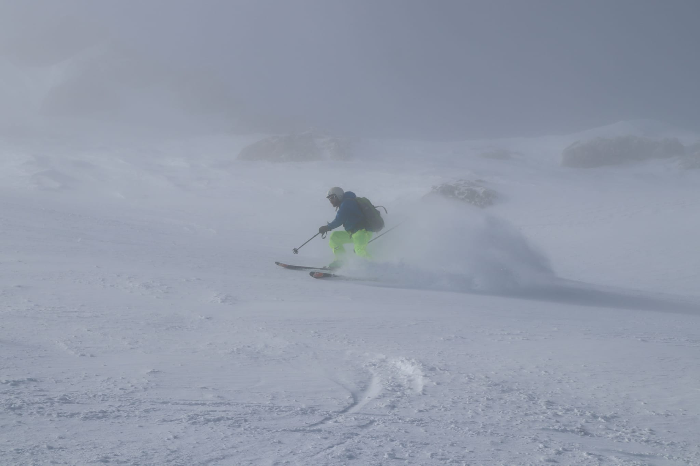

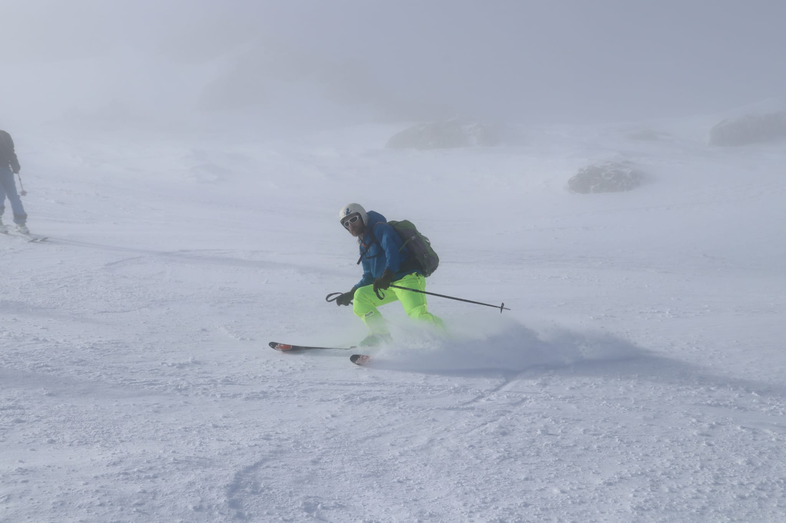

 way back: on the flat part, at the CH/IT border  

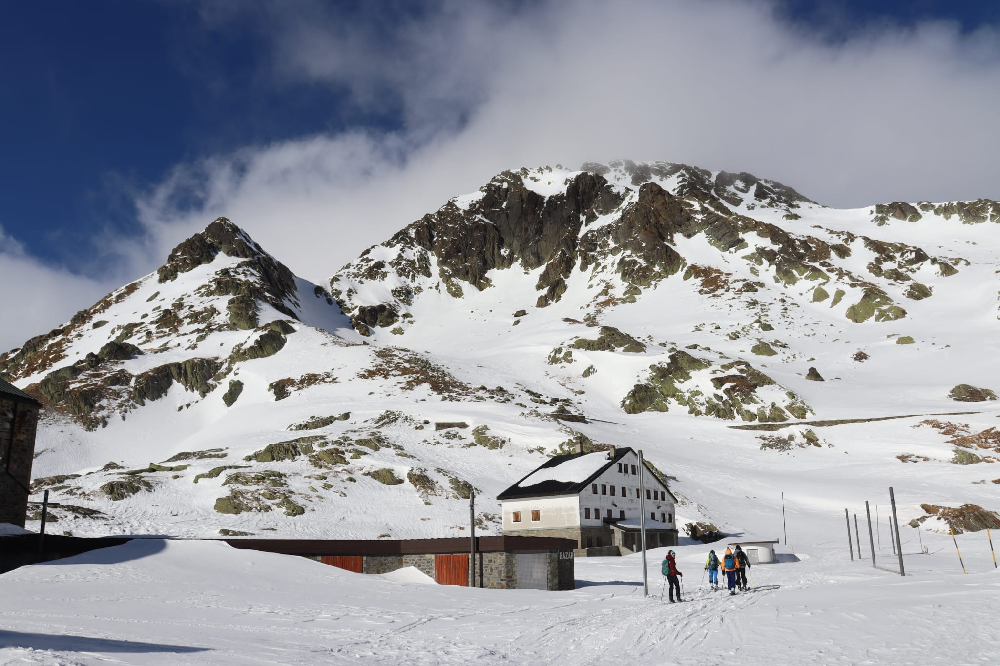

 back to the car, after a long break at the hospice ;) 

