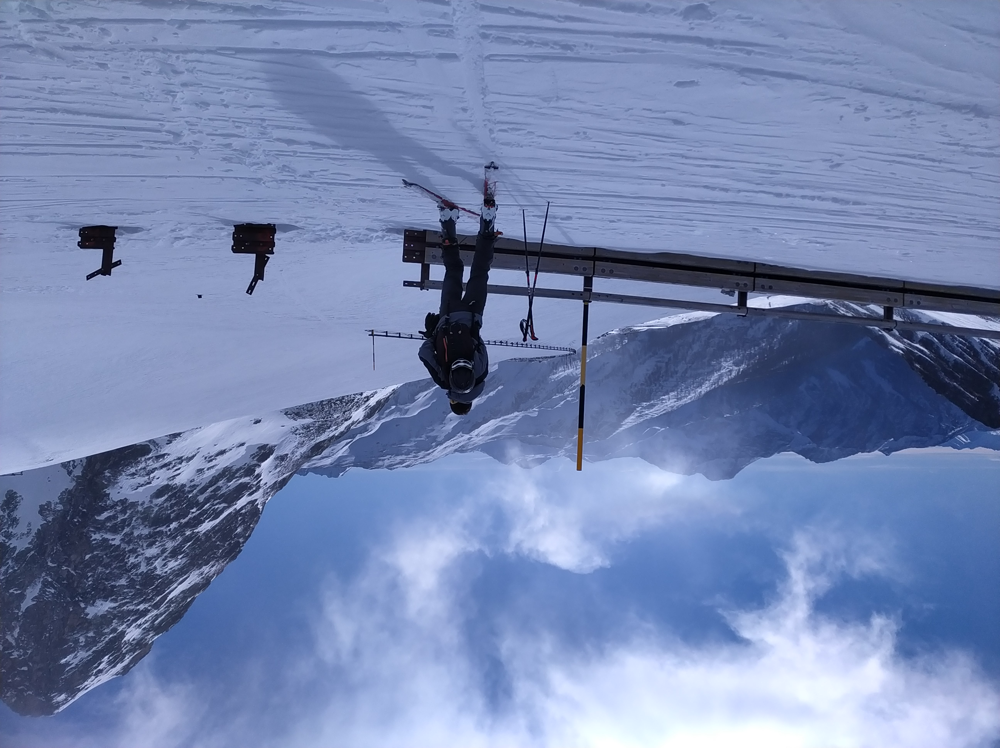
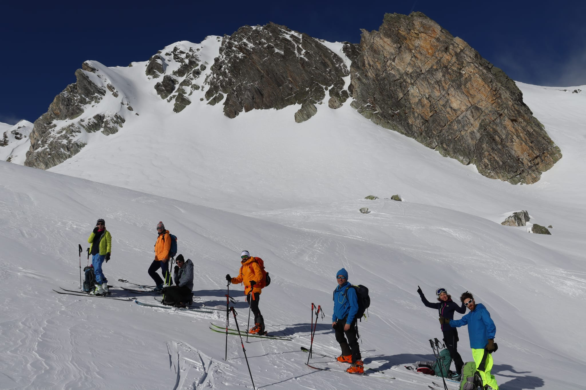
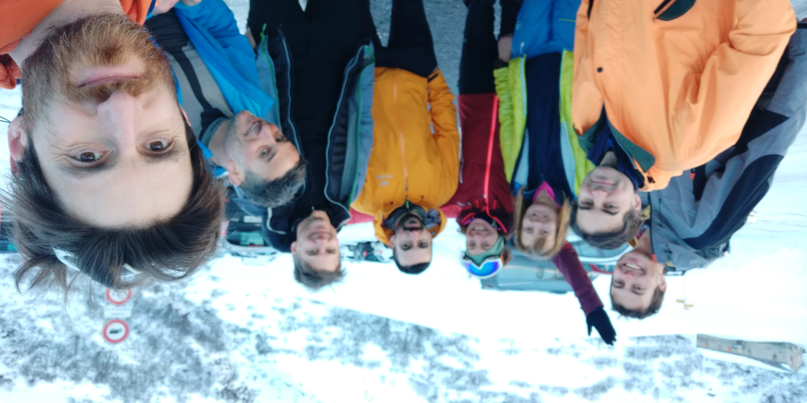

 start from the parking around 9.40 -- at Grand Saint Bernard Hospice at 11.20 

 our photographer :), during a sunny break  

 putting back the skins, for the final ascent 

 on the way up: 2nd part 

 ... in the tunnel! (no  cars :))

 getting out of the tunnel 

 almost there!

at the top

starting going down: last part it's on foot 

 yes, this time I fell only once :) 

 way back: on the flat part, at the CH/IT border  

 back to the car, after a long break at the hospice ;) 

