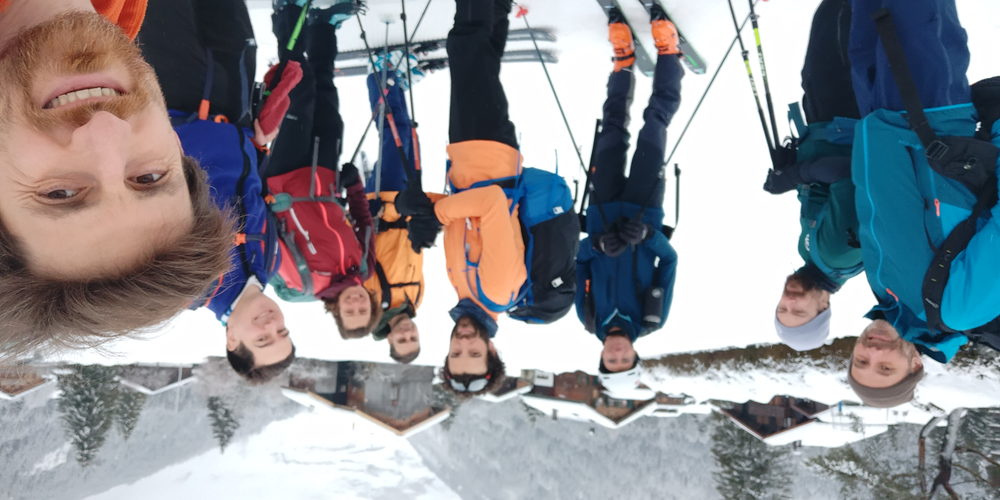
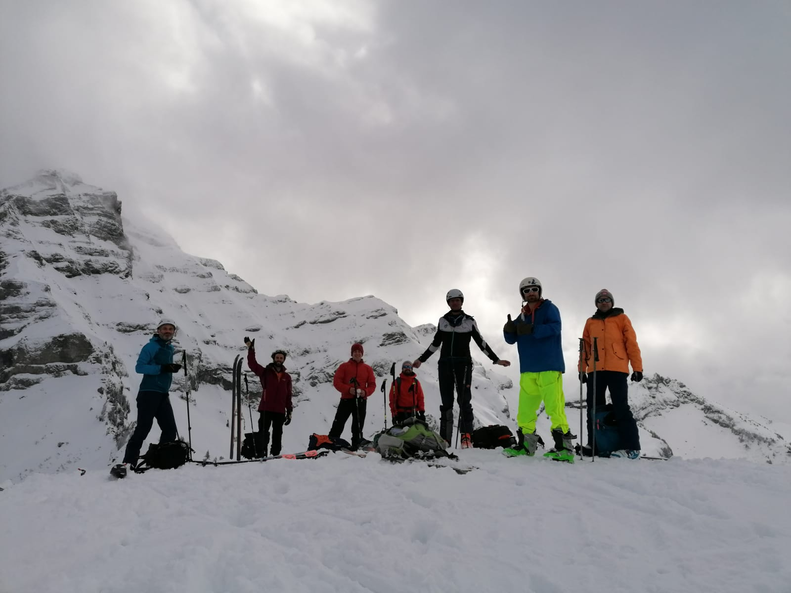
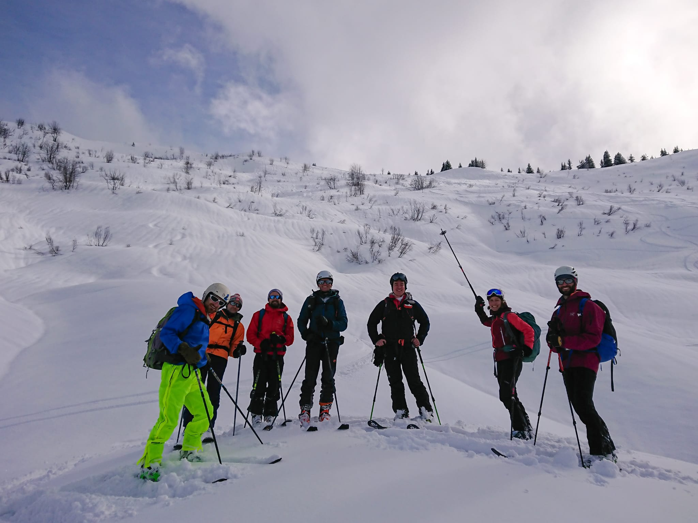
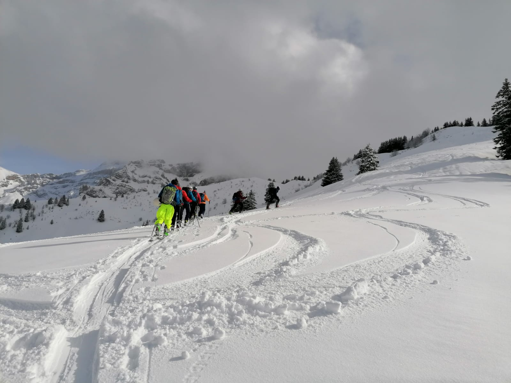
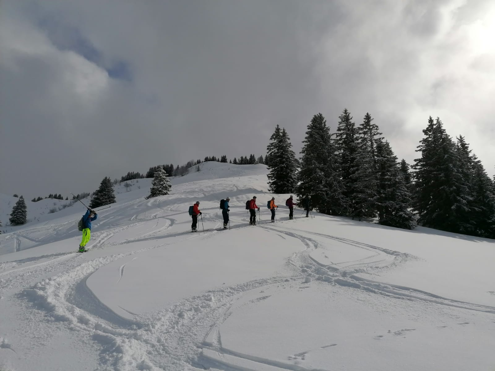
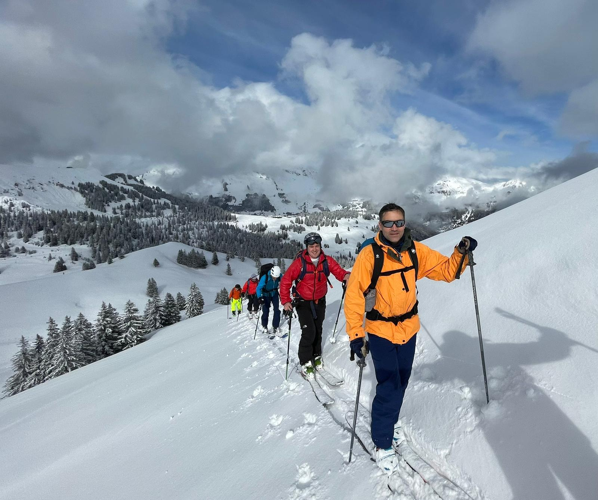

 start near the car park (we came by train :) 

 at the top 

 after the 1st descent  

 on the way up -- 2nd ridge :) 

<!-- 

 starting the ridge (Arête de Berroi) 

 nice descent in the powder

slopes, beautiful slopes... (still, good to keep some distance ;) ) 

 -->