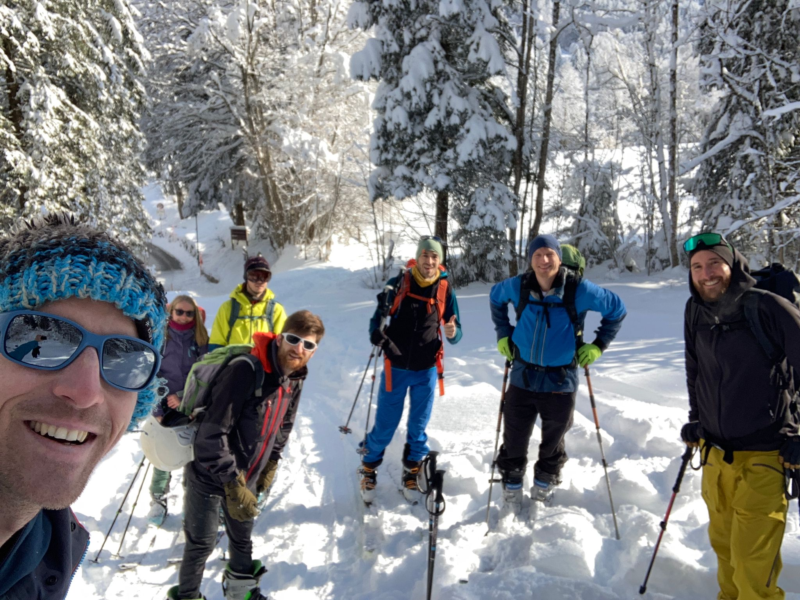
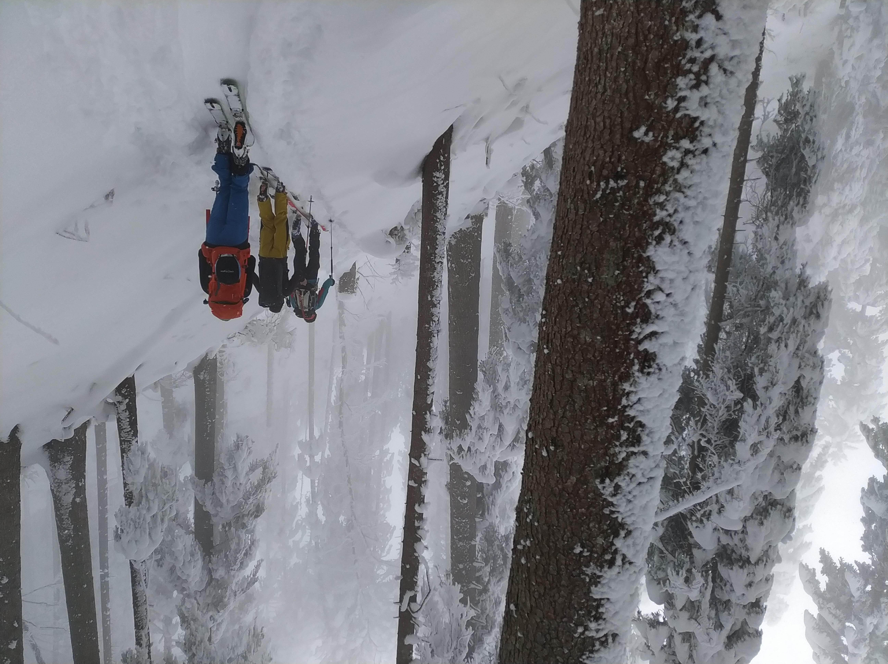
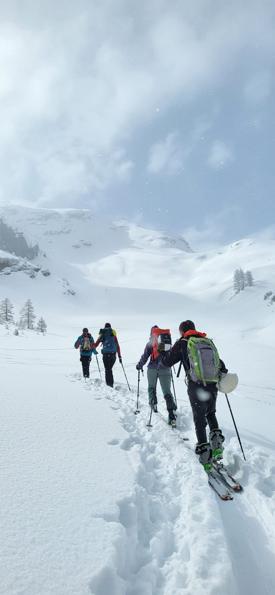
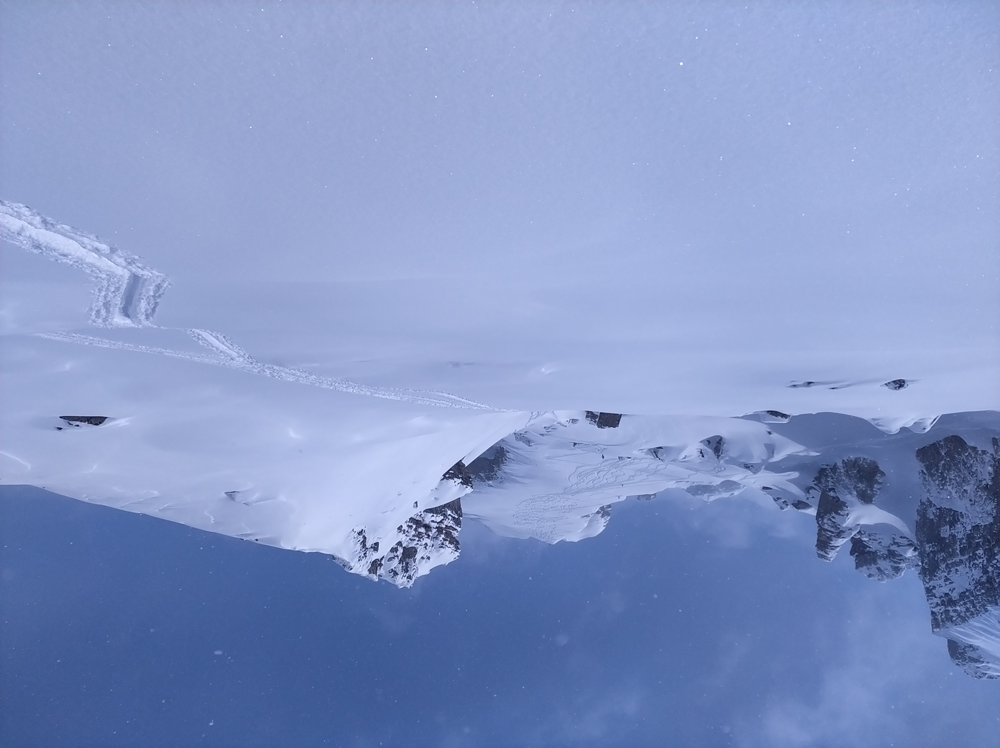
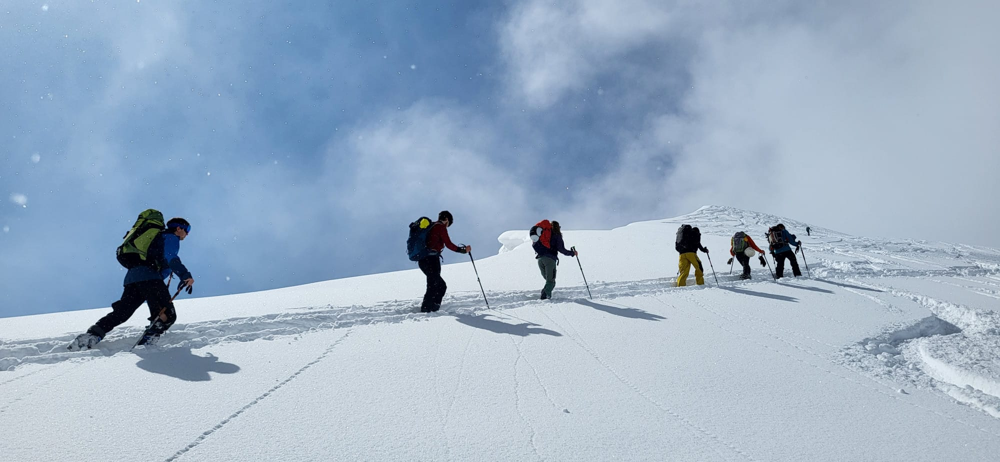
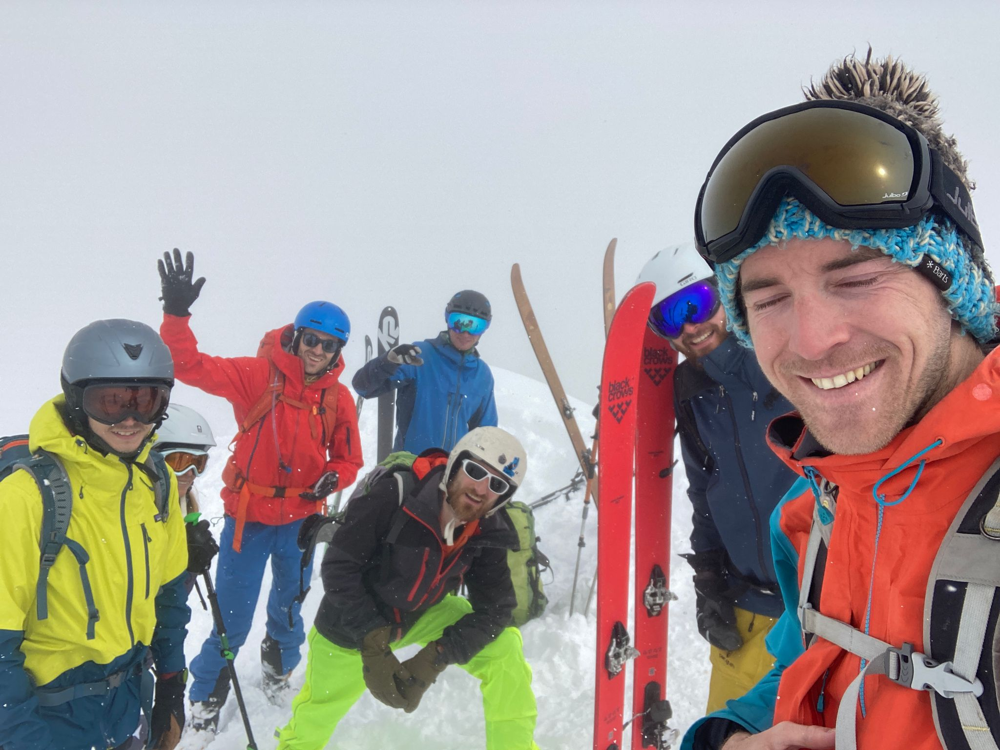
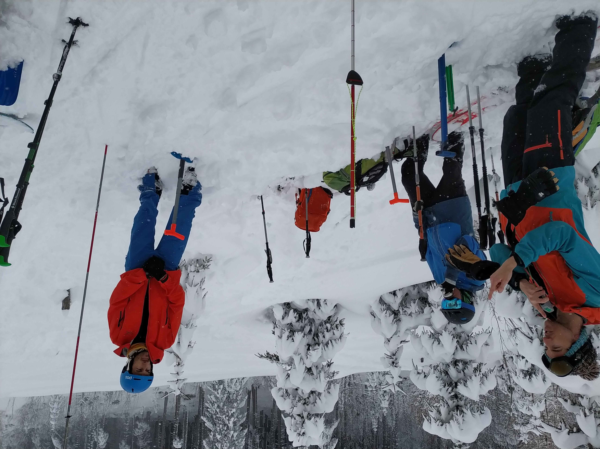

starting point, from bus stop Plan sur Bex

 on the way up, in the forest: Xmas / full winter conditions :) 

 

 in the middle of Combe d'Euzanne -- we will proceed again in the forest, turning left 

 view on the summit, from Col des Pauvres (2108 m) 

 last few steps :) 

  at the summit 

 on the way down, little but useful avalanche course :)  

 

