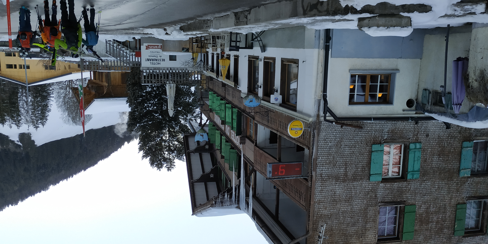
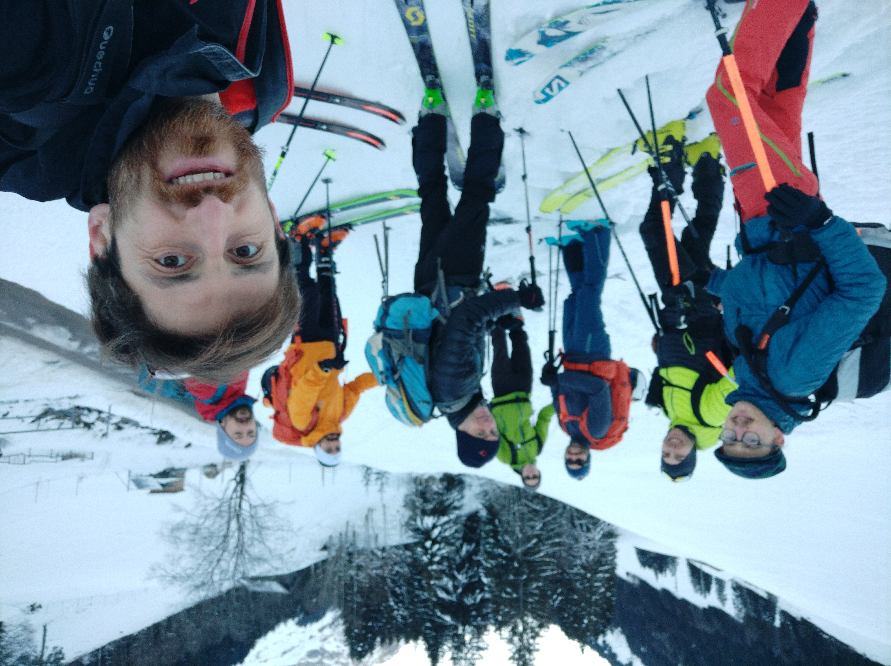
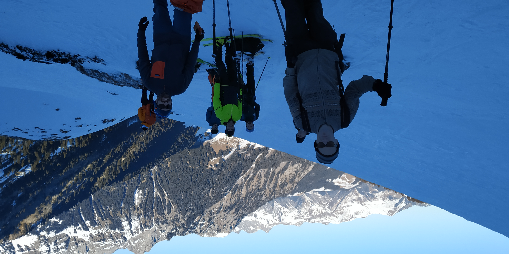
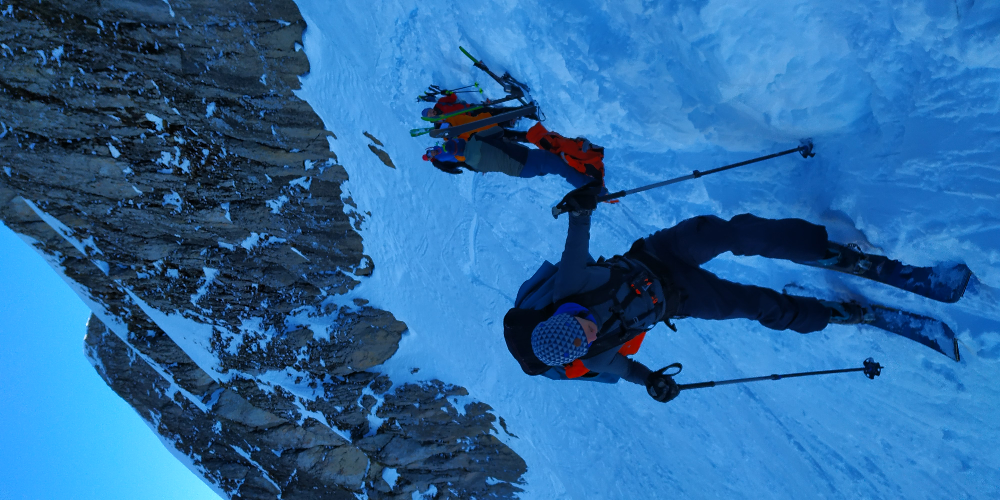
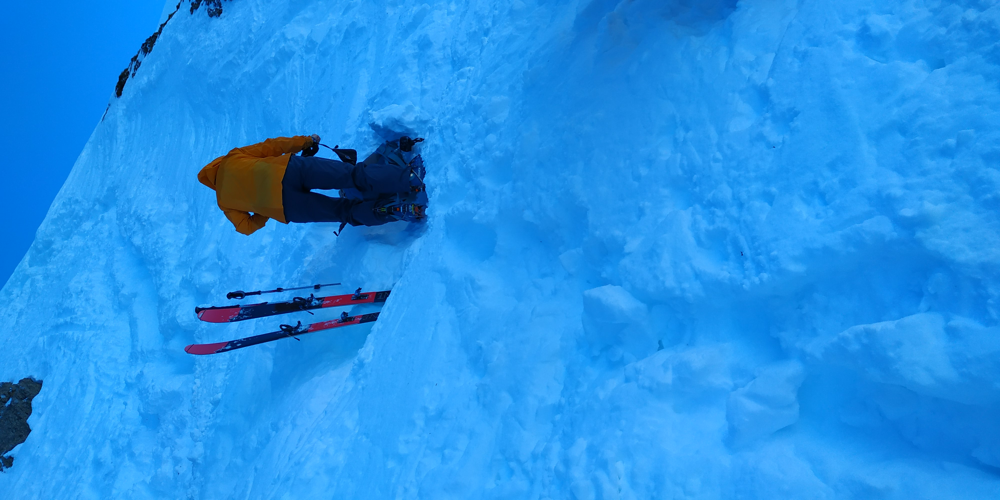
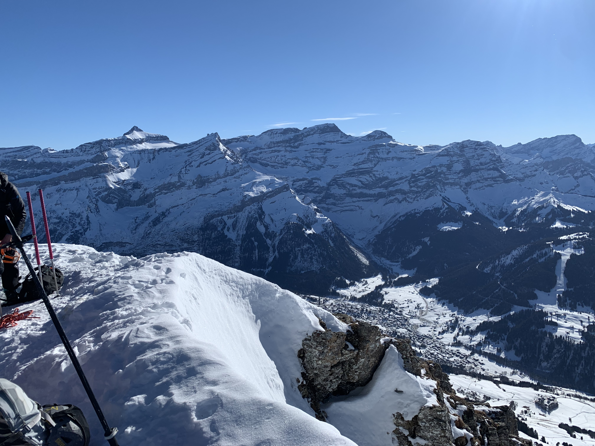

starting point, from bus stop 'Maison de l'Etivaz'

 

 ready to go! 

  on the way up 

 removing skis, just below the ridge 

 last little wall 

 view from the top -- les Diableret massif 

 video from the summit 

  
	<video  width="700" height="600" controls="true" allowfullscreen="true">
	  <source src="./assets/images/winter/tarent_CAS/VID_20220123_125819.mp4" type="video/mp4">
		Your browser does not support the video tag.
	</video>

